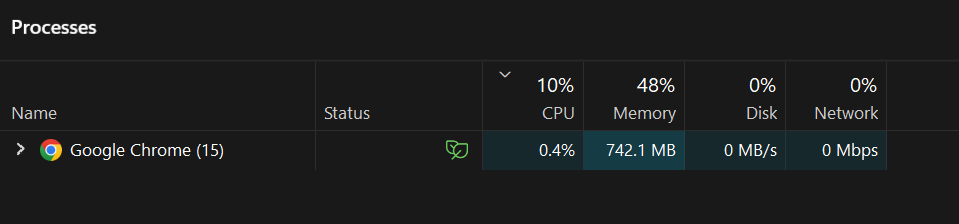
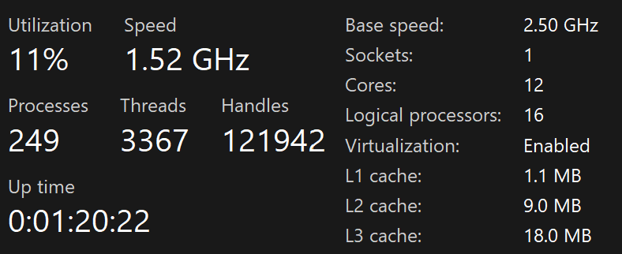

# **Task 1: Observing Task Manager**
## I opened Chrome, WhatsApp, vs code .
### And I observed that there are so many other applications are also running with these three and i mostly observed that cpu usage is less than memory ,all the processors used only 0.2 or 0% but memory is above 500 mb for every process

 

## memory is always occupaing 40 - 50 % even if not using any application ,and cpu is getting high when ttried to use any other application

 

## I observed that iam try to increase the cpu usage spo i opened multiple tabs in chrome so that the cpu usage is increased from 5 to 10 % to 84%

 

## And also I observed the sizes of L1, L2, L3 Cache in the CPU Section.
1. L1: 256kb
2. L2: 1mb
3. L3: 8MB
 

 
 
 

# **Task 2: Opening 20 Chrome Tabs & Executing Infinite Loop**
## I opened 20 Tabs in Chrome, Let's see what happens...
### Initially:
the cpu and memory usage is less like 6 - 10 % 
### After Opening 20 Tabs:
after opening more tabs the cpu usage is increased to 84%

## I executed an infinte loop
### Initially:
no high cpu usage it is like 11 - 17%
### After Executing:
1.cpu went to 64% usage 
2.memory is also 1600mb used and increasing
3.but in disk and network no change 05
 
 
 

# **Task 3: Deep Look into CPU, RAM, Disk & OS**
CPU: The brain. Fetches an instruction, decodes it, executes it — the "fetch-decode-execute" cycle, billions of times per second. Multiple cores = multiple chefs. Cache (L1/L2/L3) is tiny but insanely fast memory sitting on the chip — the CPU checks cache first before going all the way to RAM.
RAM: A fast, temporary workspace. When you launch Chrome, the OS loads Chrome's code from storage into RAM, then the CPU reads from RAM to execute it. It's volatile — power off, everything gone. Think of it like your desk.
Storage: SSD or HDD. Permanent. ~1000x slower than RAM. The OS loads programs from here into RAM before the CPU can run them. That's why opening a new app takes a second — it's reading from storage.
OS: The bridge between your code and the hardware. When Chrome wants RAM, it doesn't directly touch the RAM chip — it asks the OS. The OS manages scheduling (which process gets CPU time), memory allocation (who gets what RAM), and I/O (file reads, network, etc.).