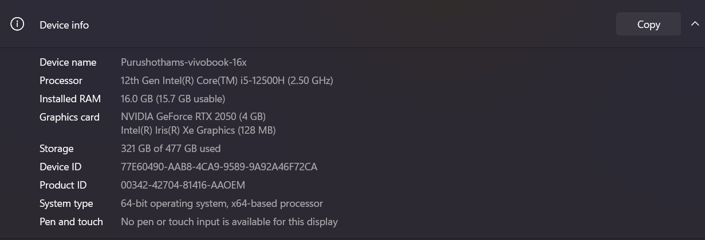
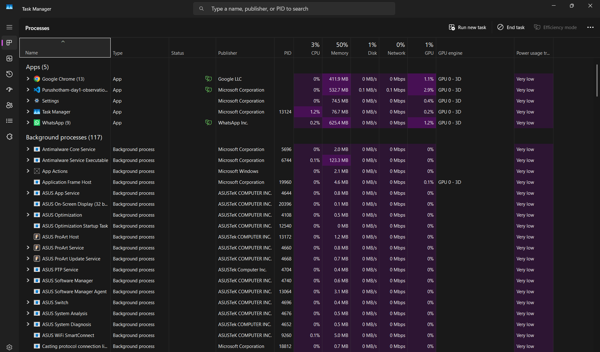
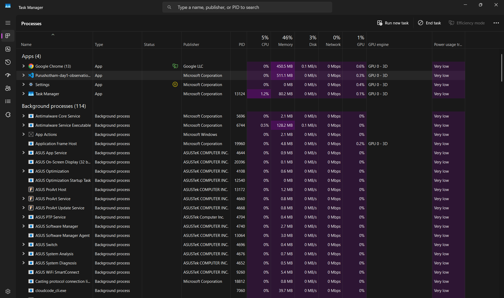
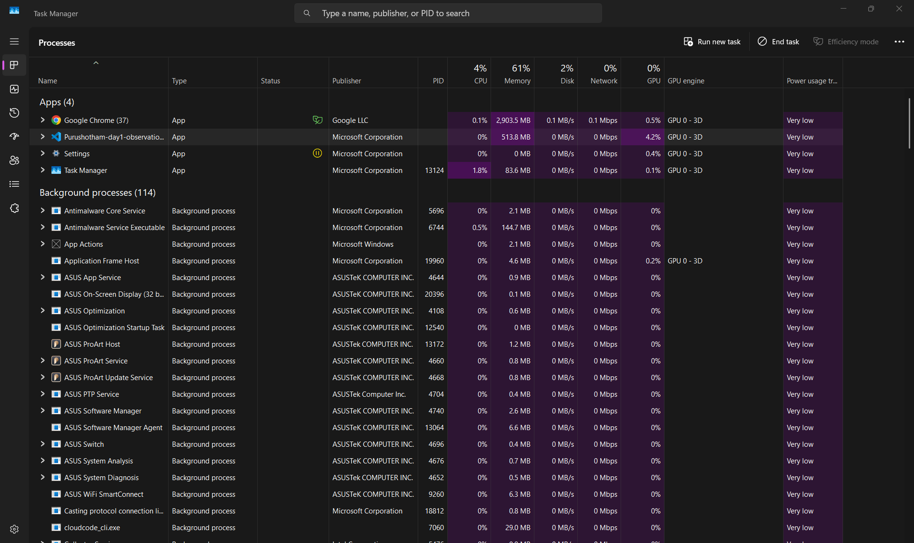
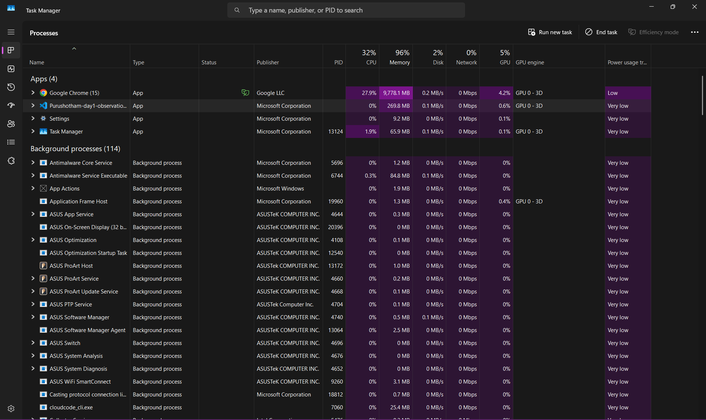

# Part 1: Task Manager Observations

## System Information



1. **What are your CPU, RAM, and Storage specifications?**
    - **A:** Intel core i5 12500H, 16GB ddr4 ram, 512GB NVME gen4 ssd.

2. **How much RAM is available when the computer is idle?**
    - **A:** 8.4 GB.

3. **How many background processes are running?**
    - **A:** 117.

---

## Chrome, VS Code, Whatsapp Analysis



- **Which application used the most RAM?**
    - **A:** Whatsapp (at 625.4MB).

- **Which application used the most CPU?**
    - **A:** Whatsapp and VS Code (at their max : 3-4% when using.)

- **Which application launched the fastest?**
    - **A:** VS Code

- **Which application consumed the most power?**
    - **A:** VS Code and whatsapp.

- **Did any application create multiple processes?**
    - **A:** All created Multiple processes:
        - VS Code: 12 processes
        - Chrome: 13 processes
        - Whatsapp: 9 Processes

- **Why does Chrome show multiple processes instead of one?**
    - **A:** Chrome uses multi-process architecture, i.e., it runs each application in it's dedicated CPU process.

- **What happened to RAM usage after closing an application?**
    - **A:** The RAM usage decreased because that application has been removed from the RAM.

---

## Experiment Questions

- **What happens when you open 10 more Chrome tabs?**
    - **A:** Chrome's RAM usage has spiked up! and no.of chrome's processes has increased.

- **Does minimizing an application reduce RAM usage?**
    - **A:** No, it doesn't reduce RAM usage.

- **Which application remained active even after closing its window?**
    - **A:** Whatsapp remained as a active background process even after closing its window.

- **What did you learn from Task Manager that you didn't know before?**
    - **A:** That i can actively monitor Usage of cpu, gpu, ram, etc and list and even kill the processes.

---

# Part 2: Chrome Tabs & Infinite Loop Experiment

## Before Experiment



- **Initial RAM usage of Chrome?**
    - **A:** 450.5 MB.
- **Initial CPU usage of Chrome?**
    - **A:** Under 1%.

## After Opening 20 Tabs



- **How much did RAM increase?**
    - **A:** It has increased up to 2.9GB.

- **Did CPU usage increase significantly?**
    - **A:** Increased up to 3% at some times and averagely 0.1-1.5%.

- **Which tab consumed the most memory?**
    - **A:** Google docs, up to 300MB.

## Infinite Loop Experiment



**Run in Chrome Console:**

```javascript
while (true) {
    console.log("HI");
}
```

- **What happened to CPU usage?**
    - **A:** CPU usage spiked up to 26-34%.

- **Did the browser become unresponsive?**
    - **A:** Yes, somewhat!

- **Did the fan speed increase?**
    - **A:** Yes after reaching a sustained CPU usage of 30% on average and RAM usage of 8-9GB.

- **What happened to other applications?**
    - **A:** Other applications memory usage is decreasing.

- **Why does an infinite loop consume CPU continuously?**
    - **A:** Yes continuously above 24-32% on average.

## After Closing Tabs


- **Did RAM usage immediately decrease?**
    - **A:** Yes, immediately decreased from the peak of 9GB to 364.9MB.

- **Did CPU usage return to normal?**
    - **A:** Yes, from peak 34% to 0.1-1%.

- **Why doesn't RAM always return exactly to the previous value?**
    - **A:** Because applications maintain cache.

---

# Part 3: CPU Deep Understanding

- **What is a CPU?**
    - **A:** CPU executes instructions and is Brain of a computer.
- **What does CPU stand for?**
    - **A:** Central processing Unit.
- **What are CPU cores?**
    - **A:** Parts of CPU which can run processes simultaneously and independent of each other.
- **What is a thread?**
    - **A:** Thread is a part of a process.
- **Why do modern CPUs have multiple cores?**
    - **A:** To execute processes and threads simultaneously.
- **What happens when CPU usage reaches 100%?**
    - **A:** Some processes are cut off short from cpu time to keep the main processes running.
- **Why does a game need more CPU power than a text editor?**
    - **A:** Game contains a lots of instructions than a text editor has.
- **What is clock speed (GHz)?**
    - **A:** The frequency at which the CPU runs and execute instructions.
- **Why is CPU called the "brain" of the computer?**
    - **A:** Because CPU is the only unit that executes instructions.
- **What tasks are CPU-intensive?**
    - **A:** Video rendering, Gaming, Code compiliation, Data processing, ML training, Compression and decompression, Encryption and decryption, Looping, etc. (_Mostly the work related to calculations and stuff_)

---

# Part 4: RAM Deep Understanding

- **What is RAM?**
    - **A:** RAM is a place in computer where processes are put temporarily.
- **What does RAM stand for?**
    - **A:** Random Access Memory.
- **Why is RAM called temporary memory?**
    - **A:** It can only store data when there is a current supply, if no current then RAM doesn't works (_dead_).
- **What happens to RAM data after shutdown?**
    - **A:** As the power is cutdown RAM also shuts down, no working.
- **Why do applications need RAM?**
    - **A:** CPU is fast, SSD is slow, so to bridge the gap apps are stored as processes in much faster RAM to be accessed by CPU.
- **What happens when RAM becomes full?**
    - **A:** CPU uses SSD as extra RAM with Swapping.
- **What is memory allocation?**
    - **A:** A process is allocated with memory address in RAM.
- **Why does Chrome consume a lot of RAM?**
    - **A:** Chrome creates a process for each tab.
- **How is RAM different from Storage?**
    - **A:** RAM is fast and volatile unlike slow and non-volatile Storage.
- **What tasks are RAM-intensive?**
    - **A:** Chrome tabs, huge ML models,

---

# Part 5: Storage Deep Understanding

- **What is storage?**
    - **A:** A unit in computer which stores data permanently.
- **Difference between SSD and HDD?**
    - **A:** SSD has no moving parts but HDD has a moving read/write Arm.
- **Why is SSD faster than HDD?**
    - **A:** SSD electrically reads and writes data but HDD has to spin the discs and move the read/write arm in order to get/store data.
- **Where are files stored permanently?**
    - **A:** On secondary storage like HDD or SSD.
- **What happens when you save a file?**
    - **A:** OS gets a system call to store the file and the OS stores the file in the secondary storage in form of a tree node (_file system is the tree here_)
- **Why does storage keep data after shutdown?**
    - **A:** Unlike RAM, storage doesn't depend on current supply to store the data. It stores the data permanently.
- **What is read speed?**
    - **A:** The rate at which data is read from HDD or SSD.
- **What is write speed?**
    - **A:** The rate at which data is written to HDD or SSD.
- **How does storage affect application startup time?**
    - **A:** The application stored in storage need to be get into RAM in order to start executing, so that retrieval time (_depends on the storage read speed_) affects the application startup time.

---

# Part 6: Operating System Deep Understanding

- **What is an Operating System?**
    - **A:** It wraps the hardware layer and provides a way to interact with hardware.
- **Why is Windows/Linux/macOS called an OS?**
    - **A:** Because they are build on top of hardware and manages the hardware.
- **What happens when a program is opened?**
    - **A:** OS fetches the program from storage, puts it in RAM (_In ready queue_) and puts up for cpu execution.
- **How does the OS manage RAM?**
    - **A:** OS allocates and deallocates RAM when asked and exited by processes respectively.
- **How does the OS manage CPU scheduling?**
    - **A:** Using queues and schedulers.
- **What is a process?**
    - **A:** A program in execution.
- **What is a thread?**
    - **A:** A part of a process or a light-weight process.
- **What would happen if there was no OS?**
    - **A:** Interacting with hardware would require lots of manual coding for every program which makes it extremely difficult.
- **Why can't two programs directly control hardware?**
    - **A:** This approach is not secure as data can be stolen by the programs or hardware resources can be misused.

---

# Part 7: Real Engineer Thinking Questions

- **Why does a computer slow down when many applications are open?**
    - **A:** RAM insufficiency in this situation causes using of auxiliary memory as main memory which slows the execution of processes.
- **Why does adding more RAM improve performance?**
    - **A:** It gives more space for processes to run.
- **Why can a fast CPU still feel slow with an HDD?**
    - **A:** CPU waits longer than executing to get the data to be executed as fetching from HDD is very slow compared to the speed of the CPU.
- **Why do browsers consume more resources than Notepad?**
    - **A:** Browsers creates individual processes for each tab opened whereas notepad doesn't require that.
- **If RAM is temporary, why don't applications constantly read from storage?**
    - **A:** Because storage is painfully slow and causes bottleneck to the fast CPU.
- **If you had ₹10,000 to upgrade your PC, would you choose CPU, RAM, or SSD? Why?**
    - **A:** RAM, because 16GB won't be enough for heavy loads of modern applications and games.
- **Which experiment surprised you the most?**
    - **A:** Infinite loop.
- **Explain CPU, RAM, Storage, and OS to a 10-year-old child.**
    - **A:** CPU is kitchen, RAM is the table, storage is the fridge, OS is the Chef.
