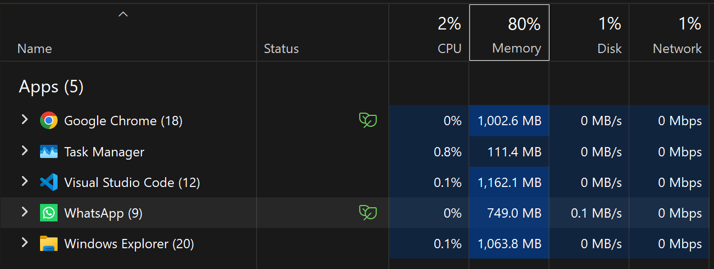
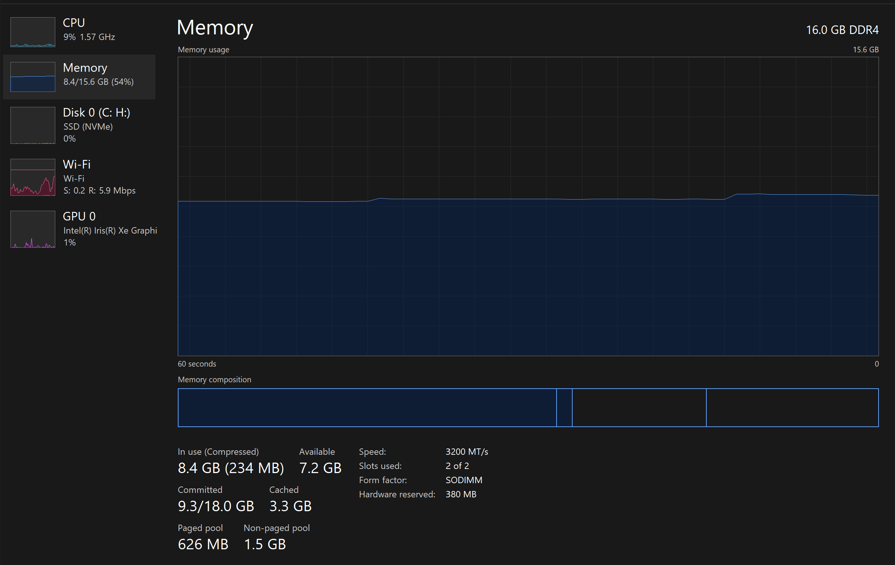
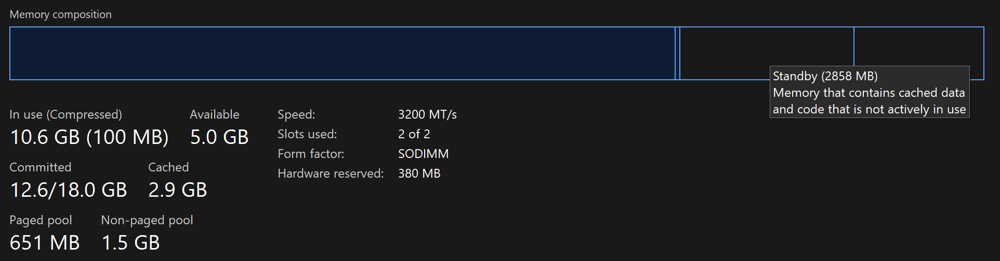
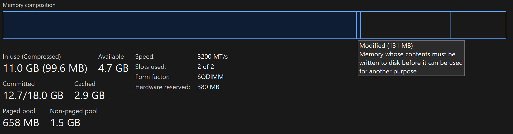

# **Task 1: Observing Task Manager**
## I opened 10 tabs of Chrome, WhatsApp, 20 windows of File Explorer, 2 windows of VS Code.
### And I observed that Memory usage is significantly higher than the CPU usage. You can see in the below screenshot.

 

## Even when no application is running other than task manager, the 62% of RAM is occupied. I don't know why.

 

## I observed the composition of RAM divided into 4 parts:
1. In use: 10.6GB
2. Modified: 131MB, The data which is saved in the RAM but hasn't write in the SSD
3. Standby: The data which is cached is 2.9GB
4. Free: 5GB
 

  

 

## And also I observed the sizes of L1, L2, L3 Cache in the CPU Section.
1. L1: 1.1MB
2. L2: 9MB
3. L3: 18MB
 

 
 
 

# **Task 2: Opening 20 Chrome Tabs & Executing Infinite Loop**
## I opened 20 Tabs in Chrome, Let's see what happens...
### Initially:
1. CPU Usage: 8-10%
2. Memory Usage: 8GB/15.6GB
3. Disk Usage: 4-6%
### After Opening 20 Tabs:
1. CPU Usage: 50-60%
2. Memory Usage: 14.6GB/15.6GB
3. Disk Usage: 40-50%

## I executed an infinte loop
### Initially:
1. CPU Usage: 5-10%
2. Memory Usage: 8GB/15.6GB
3. Disk Usage: 0-2%
### After Executing:
1. CPU Usage: 30-40%
2. Memory Usage: 9GB/15.6GB
3. Disk Usage: 0-2%
 
 
 

# **Task 3: Deep Look into CPU, RAM, Disk & OS**
