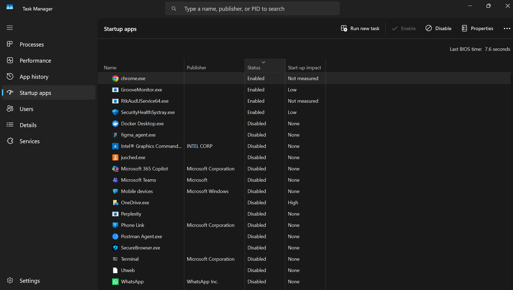

# Day 1 Observations - Patnam Prudvinath

## Task 1: Analyzing Startup Apps
* **What I Did:** I opened the Startup Apps tab to check the programs that launch when the laptop turns on. I found 4 apps enabled: a generic monitor tool, Chrome, RTKAudService64, and SecurityHealthSystray.
* **What I Saw:** I researched their importance to see what could be safely turned off.
* **What I Learned:** I learned that apps like RTKAudService64 (Realtek Audio driver) and SecurityHealthSystray (Windows Security) are critical and must stay enabled so the laptop's sound and security features work properly.

## Task 2: Network and Disk Fluctuations via Media Upload
* **What I Did:** I opened WhatsApp and uploaded a heavy 60 MB video file to a chat while watching the Task Manager.
* **What I Saw:** As soon as the upload started, the Network tab showed a clear spike in traffic. At the same time, I noticed fluctuations and small movements in the Memory and Disk columns.
* **What I Learned:** Sending files over the network doesn't just use internet bandwidth; the operating system also has to temporarily read the file from the disk and hold it in memory before transmitting it.

## Task 3: Multiple Processes for One App
* **What I Did:** I opened Chrome and looked at Task Manager.
* **What I Saw:** Chrome showed many more rows in Task Manager than the number of tabs I actually had open.
* **What I Learned:** Chrome runs extra rows for things like browser extensions and background tools. This helps the browser stay safe, because if one tab or extension crashes, the whole browser does not close.

## Task 4: Testing Memory and Disk Space (Pagefile)
* **What I Did:** I opened a lot of apps at the same time to overload the system.
* **What I Saw:** At first, disk use was low at 4% and memory was at 62-80%. After opening many apps, memory jumped up to 93-95%, and disk use slowly climbed up to 40-60%.
* **What I Learned:** When the computer runs out of real memory (RAM), the operating system starts using the hard drive as extra temporary memory. This stops the computer from crashing.

## Task 5: Running an Infinite Loop
* **What I Did:** I turned on the "Logical Processors" graph in Task Manager and ran an endless loop in the browser console.
* **What I Saw:** CPU usage went way up from 40% all the way to 90%. Memory also climbed up from 4.0 GB to 5.3 GB. When I closed the tab, everything dropped back down to normal.
* **What I Learned:** An endless loop takes up a lot of CPU power and memory. When you kill the process, the operating system cleans up the memory instantly.

## Task 6: Changing CPU Affinity
* **What I Did:** I used `Shift + Esc` in Chrome to find the process ID. Then in Task Manager, I changed the Affinity so the app could only use "CPU 0".
* **What I Saw:** I ran the endless loop again. The browser still worked normally and did not freeze up.
* **What I Learned:** By forcing the heavy loop to stay only on CPU 0, the other CPU cores stayed free. This stopped the broken tab from slowing down the rest of the computer.