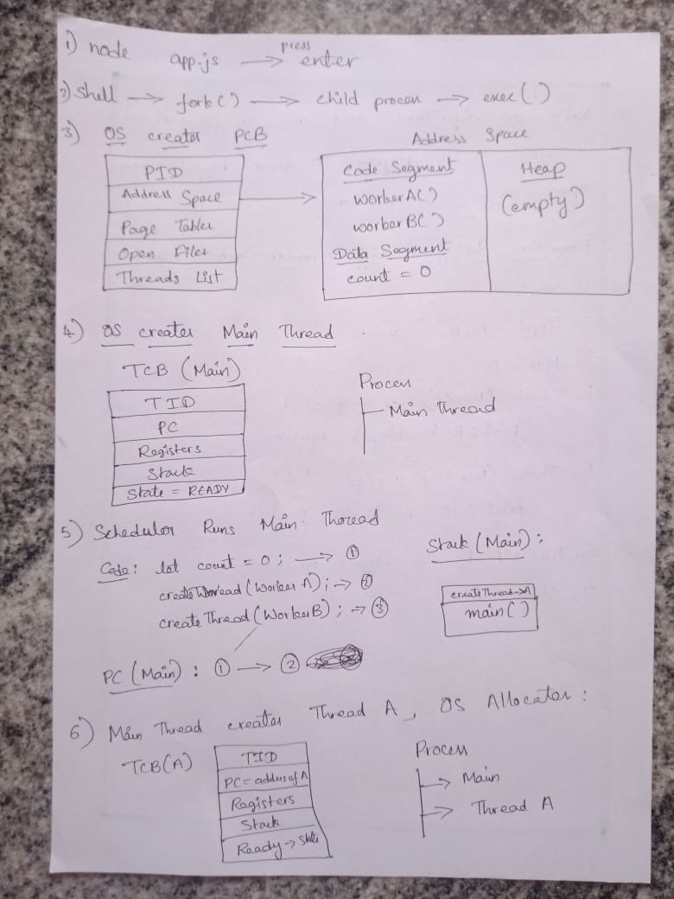
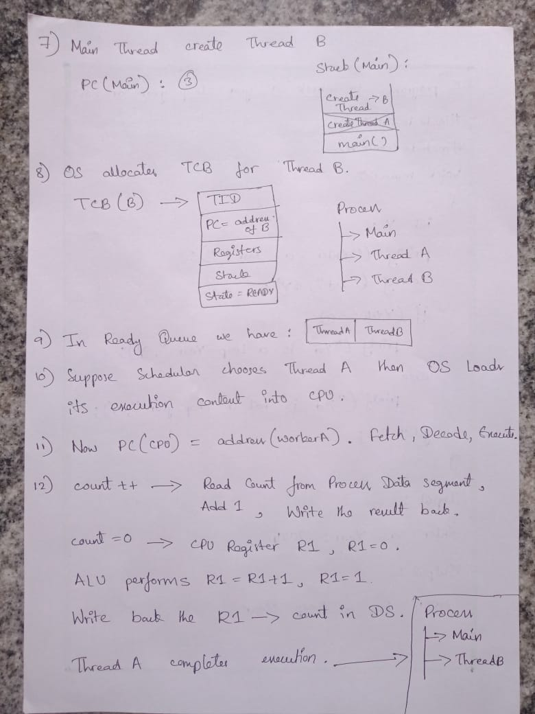
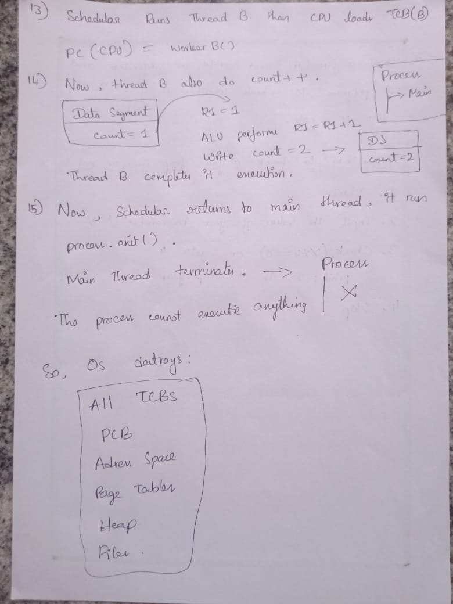

# **Threads**
## **Why threads exists & what problem they solve?**
### **Problem:**
- Early operating systems primarily provided processes as execution units. A process contains program code, virtual memory space, opened files, execution state, etc.
- If an application wants to multiple concurrent activites then the only option was to create multiple processes.
- It created several problems like creating a process required allocating a new address space, duplicating process meta data, initializing PCBs.
- The CPU spends more time on context switching because switching between processes require switching page tables, vitual addresses & heap memory.
- And also if multiple processes needs data of a process they are unable to share it directly. They need to share it through IPC, which is an another overhead.

### **Solution:**
- Researchers realized that every process has two contexts which are Resource Context: Memory, Files, Virtual address space, Page table and Execution Context: PC, Stack, Registers, Scheduling info.
- These two parts are merged as process before but OS Researchers seperated them in Threads.
- Thread is only an execution context where each thread in a process share same Resource Context but with different execution context.
- Threads solved the concurrent execution without memory duplication and switching between threads is faster because it requires saving registers, loading registers & switching stacks and easier data sharing between threads of a process.
- Important one is when a process is waiting for I/O it is blocked but with threads one blocked thread doesn't stop other threads of same process.

### Process solved protection between multiple programs, Threads solved cooperation between multiple child processes of a process.


## **What happens if threads doen't exists?**
- For to achieve concurrency instead of threads only processes would be used.
- And it would be difficult to manage memory efficently. For suppose 100 clients wants to use a Database process then without threads the server has to create 100 process with 100 virtual addresses, page tables, PCBs which is redundant.
- OS schedular can still run multiple processes on multiple cores but threads makes the parallelism cheaper within a single process.
- But developers need to create multiple process to achieve concurrency which it gives rise to more memory, more IPC, more PCB...


## **Components of Thread**
### How does CPU knows where each thread is currently execting?
- For that we need a ``Program Counter`` to store the next instruction address that needs to be executed.
- So, whenever the scheduler switching between threads the CPU knows exactly where the thread's execution should start.

### Where does the local variables of each thread live?
- For each thread to maintain its local variables, it has its own ``Stack``.
- So, they cannot be overwritten by the other threads.

### How does the CPU registers are restored when a thread execution is resumed?
- Whenever a thread's execution pauses the current state of all registers is saved as ``Register Context``.
- And when that thread's execution resumes then the OS Kernal loads the Register Context into CPU Registers.

### How does the Scheduler knows that the Thread is running or sleeping?
- The schedular should know its metadata which the status of thread is stored in ``Thread State``.

### Thread needs identity. So, every thread is assigned a ``Thread ID``.

### How does threads knows the Resource context of their process?
- They aren't stored in threads instead the reference to their process's PCB is stored.

### Where the above entire components are stored?
- Like processes has their own PCB, threads also has ``TCB (Thread Control Block)``.
- Now, PCB contains its TCBs and also the resources that can be shared among the threads.
- And TCB contains its execution context with reference to its PCB.


## **The internal working of threads**
```JavaScript
let count = 0;

function workerA() {
    count++;
}

function workerB() {
    count++;
}
```





## **Important misconceptions on Threads**
### **Process executes and then creates a main threads**
- A process can be executed with the instructions given to the CPU. It doesn't have program counter,registers, stack to schedule the CPU.
- So, without a thread process cannot execute instructions.
- At least one thread has to be created to execute the instructions.

### Each thread has its own code stored in its TCB
- The Process's PCB contains the actual code of all the threads in its Code Segment.
- But the Threads only has their code or instruction address pointed by their own PC.

### A function is a Thread
- We don't know exactly does the function actually is a thread because the thread is just a execution state.
- It only know where execution currently is and what CPU state is needed to continue.


## **What an experienced engineer thinks about Threads that beginners usually miss.**
- We think threads are sharing the same memory or resources of a process it is decreasing redundancy of resources by avoiding to create multiple processes instead of threads.
- But sharing same resources might create the race condition when multiple threads are accessing the same resource at a time.


## **In which apps or tech threads are used?**
- In browser we can see many threads running parallel like UI thread, Network thread, JS thread, etc.
- In games we can see audio thread, physics thread, rendering thread, etc will run parallel.
- Also in whatsapp when we are receiving messages it must update UI, download media, encrypt data, etc.