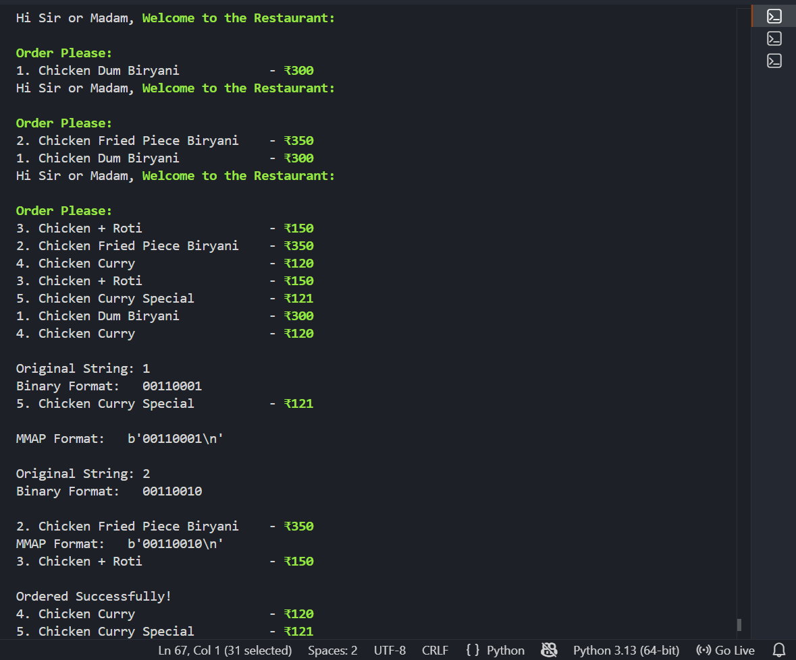

# Day ~ 10 [Observations - PATNAM PRUDVINATH]

# Today's Concept: Project on Threads, Process & Virtual Memory

---

### So First i Started with user.py
- Where user can make orders.
- So for that i created a menu for him.
- I create an array of object to store food items & prices and using index i created the menu.
- To order user can just give Serial Numbers which is index.
- After entering the Numbers user will hit enter to complete his order.
- I will store that numbers in a file "orders_details.txt".
- By converting that numbers into binary format and by using mmap i will store the ordertails - I used new line to separate the orders.
- And i will validate the Numbers entered by User [Is there are in Serial Or Not].

### And now in dashboard i will access the data in that file "order_details.txt"
- So here i will read the data in that file using mmap.
- I will get it binary form in and then i convert it to normal and form and print that data.
- And i used while loop & time.sleep method to acheive that "run the program for every 3 seconds to get new data".

Till now i haven't implemented features like Thereads or Process i want improve this to that level. 

Let's see

=============================

USER.PY FLOW

=============================

Start User.py
[OS creates a new Process for User.py]

↓

Python Interpreter Loads
[Code, Stack, Heap, Libraries loaded into Process Virtual Memory]

↓

Check orders_data.txt Exists
[Ask OS/File System whether file exists]

↓

File Exists? 
│ 
├─ Yes 
│  [Continue] 
│ 
└─ No 
   [Create Empty File on Disk]

↓

Display Menu
[CPU executes print statements; terminal receives output]

↓

Wait For User Input
[Process enters waiting state until keyboard input arrives]

↓

User Types: 143
[Keyboard → OS → User.py Process]

↓

Validate Input
[Ensure only numbers 1-5 exist]

↓

Convert To Binary String
[Convert characters into ASCII binary representation]

Example:

1 → 00110001
4 → 00110100
3 → 00110011

↓

Encode To UTF-8 Bytes
[String becomes raw bytes suitable for storage]

↓

Open File (r+b)
[OS opens file and returns File Descriptor]

↓

Get Current File Size
[Ask OS how many bytes currently exist]

↓

Expand File
[f.truncate() grows file size before writing]

↓

Create Memory Mapping
[mmap asks OS to map file pages into Virtual Memory]

↓

OS Creates Mapping
[Virtual Memory Region ↔ File Pages relationship established]

↓

Write Bytes Through mmap
[Bytes written into mapped memory pages]

↓

Page Marked Dirty
[OS knows RAM contents changed and SSD must be updated later]

↓

Close mmap
[Mapping released]

↓

Close File
[File Descriptor released]

↓

Process Ends
[OS destroys Process, releases resources]

==============================

DASHBOARD.PY FLOW

==============================

Start Dashboard.py
[OS creates separate Process]

↓

Python Interpreter Loads
[Code, Variables, Libraries loaded into Virtual Memory]

↓

Enter Infinite Loop
[Dashboard continuously refreshes]

↓

Call get_dashboard()
[Function execution begins]

↓

Clear Screen
[Terminal cleared]

↓

Open File (r+b)
[Request file access from OS]

↓

Create mmap
[Map file pages into Dashboard's Virtual Memory]

↓

Read Line 1
[mmap reads bytes from mapped region]

↓

Decode UTF-8
[Bytes → String]

↓

Convert Binary To Digits
[00110001 → 1]

↓

Convert Digits To Food Names
[Lookup inside food_items list]

↓

Calculate Total Price
[CPU arithmetic operations]

↓

Display Order
[Terminal output]

↓

Read Next Line
[Continue until EOF]

↓

Close mmap
[Release mapping]

↓

Close File
[Release File Descriptor]

↓

Sleep(10)
[Process enters Waiting State]

↓

Wake Up
[OS Scheduler gives CPU again]

↓

Repeat Entire Process
[Loop starts again]

>so i changed code, tested multi-threading started call user.py functionality which making an order for multiple time using thread concept in Python.

