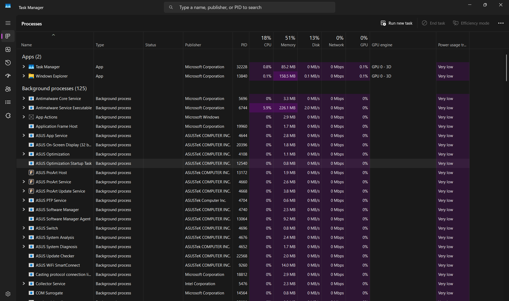
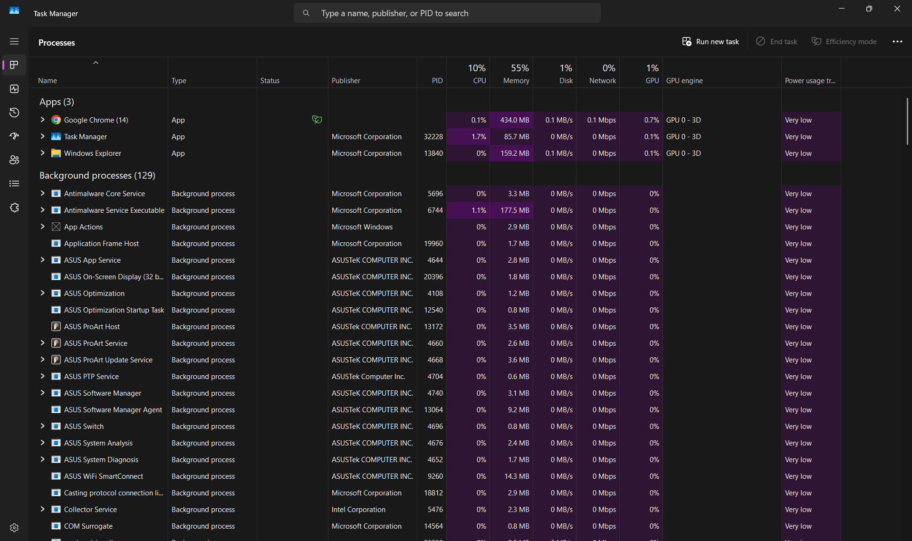
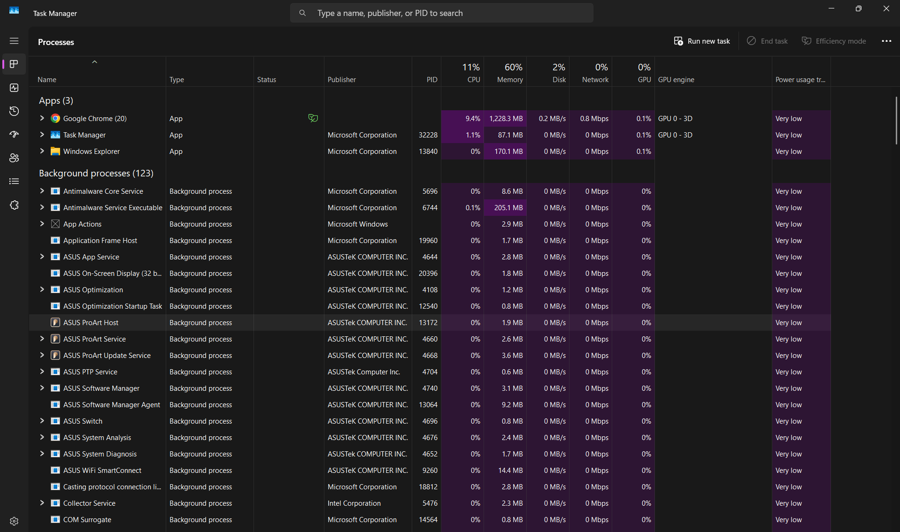

# PART-1 Experiment:-

1. **Initial state (_task manager and windows explorer are open_)**
   
2. **Chrome is opened.**
   

**Q:- Why there are multiple chrome entries?**

**A:-** Because those are multiple processes initiated by chrome.

3. **5 tabs are opened.**
   

**Q1:- Did the memory increase?**

**A:- Yes.**

**Q:- Did process count increase?**

**A:- Yes**

**Q:- Why?**

**A:- Because opening tabs increased no.of processes and in turn increased memory usage.**

4.

**Q1:- What changed?**

**A:- Memory usage decreased.**

**Q2:- What remained same?**

**A:- CPU usage.**

# PART-2 Learn:-

## Step 1: Program

**1. When VS Code is not running, does it consume CPU?**

**A** .No, it does not uses CPU when it is not running.

## Step 2: Process

**2. What additional things does a process need?**

**A** . Process needs resources, memory, CPU, thread and if needed Input also.

## Step 3: Thread

**3. Why might Chrome need multiple workers?**

**A** . To handle multiple processes/jobs concurrently.

# PART-3 Research:-

**Q:- Why does chrome uses multiple processes?**

**A:-** 1.Chrome mainly leverages the isolated memory concept of the processes to separate each and every website data isolated and other tabs can't access them.

2. As processes are isolated by memory and cannot access other process memory, the process is effectively sandboxed in it's memory or environment, if one tab is compromised, other tabs be safe due to this.

3. But as processes are memory heavy, this hits the chrome with a performance tradeoff as it is heavy to run as tabs grow.

4. And as the tabs are isolated with multi-process architecture and are isolated in their individual "sandboxes", chrome is resilient to tab crashes as if one tab crashes, that process only is terminated and other tabs are immune from this.

_Main points and keywords :-_

    => Memory Isolation
    => Resource Ownership
    => Security Boundary
    => Failure Boundary
    => Execution Context

# PART-4 Reflection:-

## What happens When whatsapp is opened?

    Mouse Click
          ↓
    Operating System
          ↓
    Launch WhatsApp.exe
          ↓
    Create Process
          ↓
    Allocate Memory
          ↓
    Create Threads
          ↓
    Load Code From SSD
          ↓
    CPU Executes Instructions
          ↓
    Create Window
          ↓
    GPU Draws Interface
          ↓
    DNS Lookup
          ↓
    TCP Connection
          ↓
    TLS Encryption
          ↓
    Authenticate User
          ↓
    Sync Messages
          ↓
    Render Chats
          ↓
    Wait For Events
