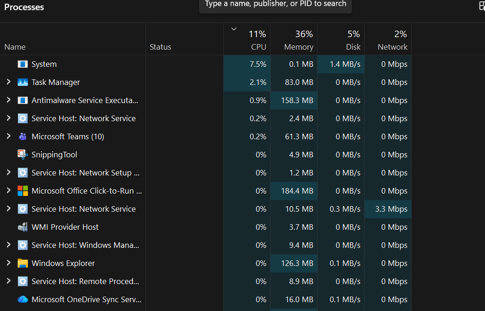
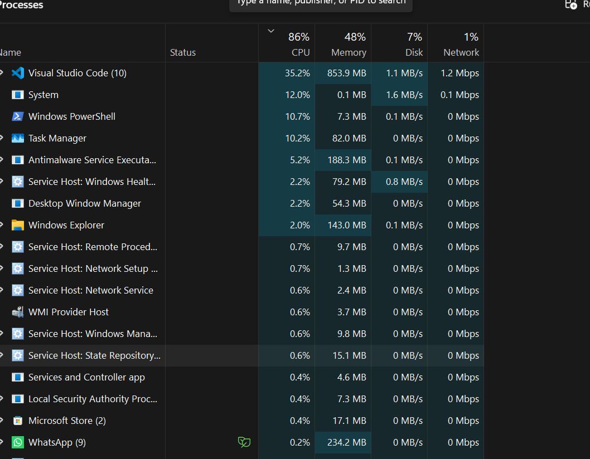
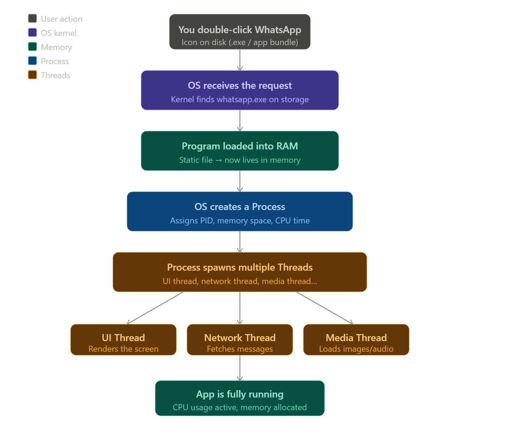

### What actually happens inside the computer when I click an application?
when i click an application at first the os loads it from storae to ram before the cpu actually process it after that the cpu runs the application frm ram and performs it 
 ## DOD
 1. What is a Program?
2. What is a Process?
3. What is a Thread?
4. Why Chrome creates multiple processes?
5. What happens when WhatsApp opens?

What is a Program?
A program is just a static file sitting on your disk — like whatsapp.exe or code.exe. It's instructions written in code, stored as binary. It does nothing on its own. No CPU usage, no memory usage. It's like a recipe book sitting on a shelf.
What is a Process?
When you run a program, the OS creates a process — a program that's actually alive and executing. A process gets:

Its own memory space (RAM allocation)
Its own CPU time
Its own file handles, network connections
A unique Process ID (PID)

## Part 1 - Experiment
# task -1
opened FE and TAskmanager observed the changes

<!-- 

# TASK -2
opened chrome and FE and vs ,whatsapp and observed

<!--  -->

## multiple chrome entries 

<!--  -->
Because for every tab chrome raises a new process for each new tab in chrome it creats new process

## TASK -3
opened 5 mutiple apps and observed changes in taskmanager
cpu usage increased and memory usge is also increased
## TASK -4 
after closing all the tabs i observed that the cpu and memory usage is slightly decreased after closing them all

## Part 2 - Learn

# When VS Code is not running, does it consume CPU?
no, if vs code is not running the cpu consumption is absent ,because cpu allocation is only done when the app is started or running

# What additional things does a process need?'
a process need cpu ,memory,network,disk all these are required for a process

# Why might Chrome need multiple workers?
chrome need mulptiple workers because for chrome for every new tab it need new process so to create them it must neeed workers

Key point: Two processes can't access each other's memory by default. This is isolation.
What is a Thread?
A thread is a unit of execution inside a process. One process can have multiple threads running concurrently.
Think of it this way:
Process = A restaurant kitchen
Thread  = Individual chefs working inside that kitchen
All threads in a process share the same memory. So Chef A and Chef B both use the same fridge (memory). This makes threads fast but risky — one bad thread can corrupt shared data.

## Why does Chrome use multiple processes?
chrome usese multiple process because it creates new process for every new tab for that tab need security and stabiliy for all that purposes it should create multiple processes

Why Chrome Creates Multiple Processes (Full Answer)
Chrome uses a multi-process architecture called "Process Per Site" (or tab). Here's the real why:
1. Stability
If one tab crashes (say a buggy website), only that tab's process dies. The rest of Chrome keeps running. With single-process, one crash = entire browser dies. You've seen this — one tab freezes, other tabs still work.
2. Security (Sandboxing)
Each tab runs in a sandbox — an isolated process with restricted OS permissions. Even if a malicious website runs inside that tab, it can't access your file system, other tabs' data, or passwords. The process boundary is the security wall.
3. Performance
Multiple processes = OS can distribute them across multiple CPU cores. Tab 1 runs on Core 1, Tab 2 on Core 2. True parallelism. Single process = everything queues on one core.

## Part 4 - Reflection
Create a Diagram on what happens when WhatsApp is Opened.

click on whatsapp --> os loads whatsapp from storage to RAM --> memory usage increases --> CPU starts running the whatsApp --> new process creates --> cpu usage increases
<!--  -->
<!--  -->