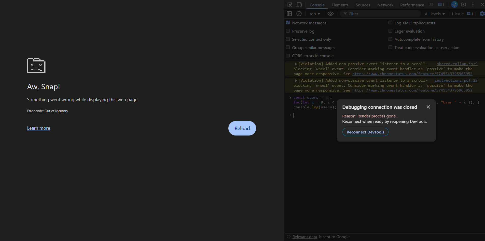

# Day ~ 2 [Memory Fundamentals Mission]
# Observations - Patnam Prudvinath

## Part -1 [If RAM is full, where new data will go?]

### My Assumption: 
---
I think OS will use the **swapping** method to get some space in **RAM**. 
i.e The data which is unused for more time will goto secondary to create some space in Primary Storage.

### And Research on My Assumption:
---
Gemini Agreed with my assumption, i asked if there is any issue or need to improve please tell, even then also **Gemini** said it is OK, this is the only thing happened when **RAM** is getting filled.  
And my intresting follow up for this problem is, **what will happen when secondary storage also getting filled by swapping** - Gemini said this is called **Thrashing**, without executing tasks, if OS spend more time on swapping it is Thrashing when Secondary storage getting filled it leads to **Extremely slow or freeze in system performance and programs may crash due to out-of-memory erors**.

---
## Part -2 [Where does the variable exist while the web page is running?]

### My Research
---
So I created a html file and wrote the script there, opened it in browser. 
In console i got the value of the variable, i observed source tab too, but i got the solution where variable exist.  
So i used Gemini to get to know about it, The normal primitive data will live in Call Stack. The User defined data like classes & object will leave in Heap or Stack. 
And they both live in Javascript V8 engine, which lives in Chrome Process.
 And source tab is just interface for static files which are running in broswer, the data will be created at run-time in V8 engine.

## Part - 3 & 4 Experiments [Running some high end task to see the memory usage in real]

So Before running any high-end tasks 
[CPU(3-8%), Chrome(0-3% CPU)] 
[Memory(90%), Chrome(1GB)] (I already will put 7,8 opened so that's why)
[And Disk(1-10%), Chrome(0.1MB)].

After running a loop with 1000 iterations, storing & updaing data using object. 
[It ran very fast so i didn't find any spikes here].

Now with 100000 
So, still no use

Then I went for 100000000000, and
Now it is different, 
First i didn't saw the output immediately 
Now i find spikes here. 
CPU went to 80-90% usage 
Memory went to 90-95% usage 
No change in disk 
And suddenly i got popup like this,  
 
I got error popup image when i put high load to Memory & CPU.

## Part - 5 [Deep Dive: My Journey into RAM, Stack, and Heap Architecture]

### Connecting the Physical to the Software
So, we already know that when we open Chrome, the OS gives it a chunk of physical **RAM** to create a process. 
But inside that process, things get interesting. The **Stack** and the **Heap** aren't physical chips inside the laptop; they are logical software structures that the V8 JavaScript engine builds inside that allocated RAM to manage my data. 

Here is how I understand how they actually work:

---

### The Call Stack - The Organized Pipeline
Think of the Call Stack like a neat stack of books placed one on top of another. It handles our function execution in a strict *LIFO (Last-In, First-Out)* order. 

* *How it handles the code:* When my main program starts, it goes on the stack. If it calls a function, that function piles right on top. 
* *How it accesses data:* The engine uses a *Top Pointer* to always interact with whatever is sitting at the very top.
* *The Lifecycle:* Access is ultra-fast. When a function hits `return`, it gets popped off and instantly cleared. If an infinite loop keeps piling functions up, it overflows.

---

### The Heap - The Flexible Warehouse
Unlike the orderly stack, the *Heap* is a massive, unorganized warehouse for data that changes size dynamically—like objects and arrays.

* *The Connection:* When I write `let user = { name: "Prudhvi" }`, the actual object `{ name: "Prudhvi" }` lives in the Heap. The Heap generates a memory address pointer, and *that pointer address* is what gets stored on the Stack. My code reads the address from the stack and jumps to the heap.
* *How it accesses data:* It uses *random-access*. With the direct memory address, the engine jumps straight to that spot anywhere in the warehouse.
* *The Lifecycle:* Data stays here even after a function ends. To keep it from filling up, the *Garbage Collector* periodically scans the heap, finds any abandoned objects with no stack variables pointing to them, and deletes them to free up RAM.