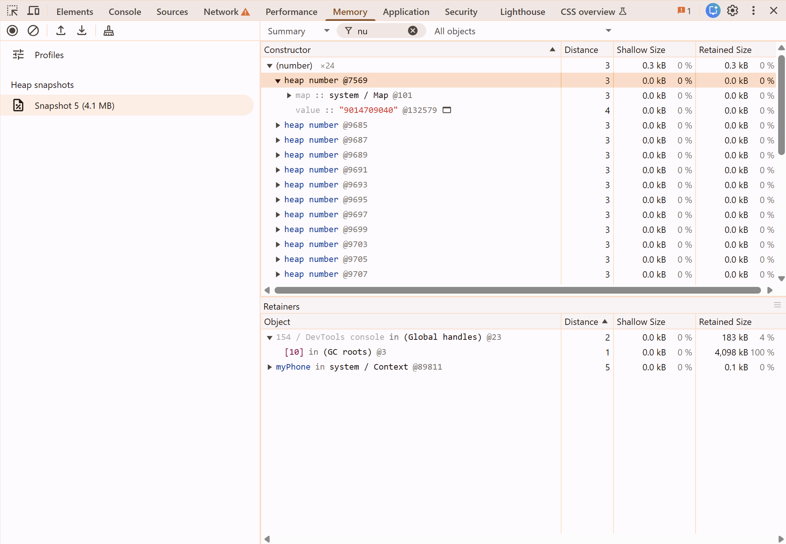
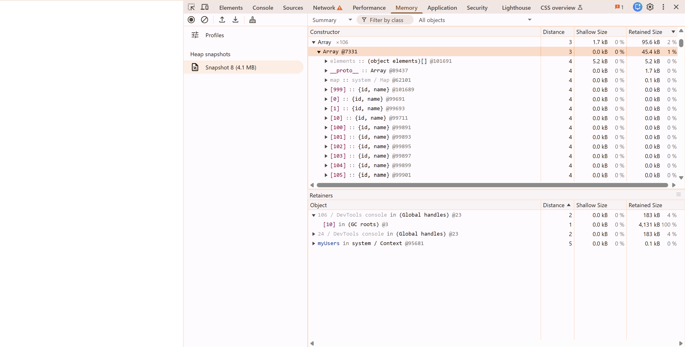
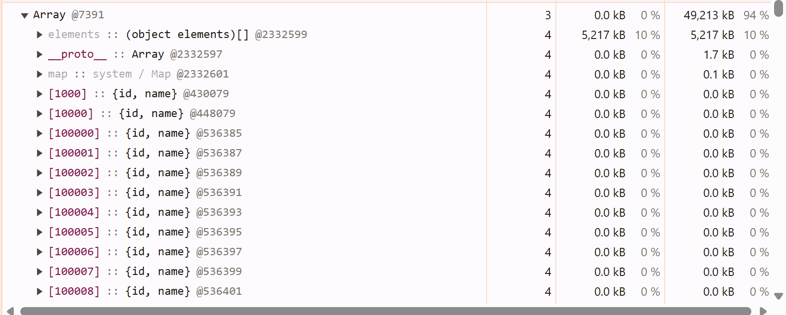
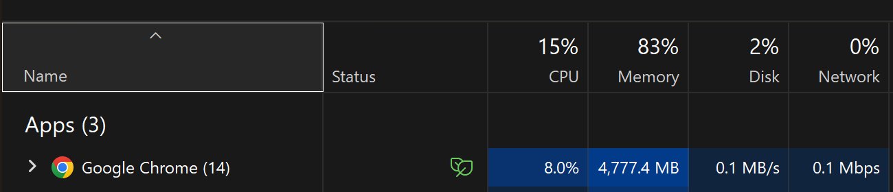
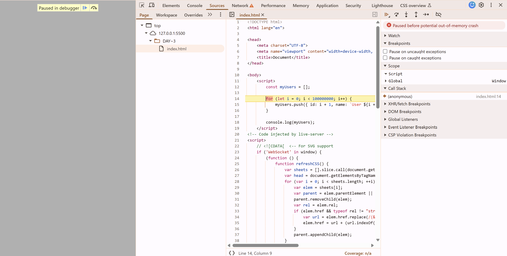

# **Part 1 - Mental Movie**

## **If RAM is full then where the new data is stored?**

### **My Assumption**: The new data is stored in SSD as we know the RAM is full. And if the CPU wants that new data then the OS removes the unnecessary data in the RAM and keeps it for to make it available to the CPU.

### **Actual Process**:
1. OS removes less used memory blocks
2. OS saves or moves them to SSD
3. RAM gets freed
4. Now, OS allocates memory for the new data

#### And these swapping process is called paging.

### **What if SSD & RAM both are full?**
- OS may kill processes
- OS may remove some memory blocks
- OS may show Out of Memory Errors

<br>

# **Part 2 - Variable Existence**

## **I created a HTML Page with JS Script where a String Variable is intialized. Where does the string variable exists?**

### ``const myPhone = 9014709040;``

### **My Assumption:** I knew that ``9014709040`` exists in **Stack** in RAM because a string is a literal it doesn't grow and it is static.

### **Realisation**: We cannot determine wheather a Variable is stored in Stack or Heap because V8 engine hides the implementation. What we need to Understand is:

- For every variable in a process need memory to be allocated.
- Different memory regions exists for different purposes.
- Stack stores static & short lived data.
- Heap stores dynamic data.
- A value exists in the memory until it is reachable by a retainer.
- If a value doesn't get referenced by a retainer then it is removed by a garbage collector in the memory.

<br>



<br>

# **Part 3 - Dynamic Data**

## **I executed the below JS code in an HTML File.**

```
const myUsers = [];
for (let i = 0; i < 1000; i++) {
    myUsers.push({ id: i+1, name: `User ${i + 1}` });
}
console.log(myUsers);
```

### And I observed that the Array which is binded by myUsers has occupied more memory (45.4KB) than other Arrays in the Context of this Process.
<br>



# **Part 4 - Increase Memory Load**

## **I increased the users load from 1000 to 1000000. Let's what happens.**

### It took nearly 1 min of time to take the snapshot of the heap memory in the dev tools.

### And the Array used nearly 50MB of memory to store the objects data.



## **Now, I increased the users load from 10,00,000 to 10,00,00,000.**

### We can see the CPU & Memory usage of Chrome increased significantly as we can see in the below.



### Finally, the program doesn't get executed completely. And an error is shown like Out of Memory crash.



## From this experiment, I understood today's lesson that for every object & data we create needs memory and at scale the memory becomes a biggest asset to be maintained properly.

## That's why we have paging, lazy loading & streaming concepts to store or load the data which is needed.

<br>

# **Part 5 - RAM, Stack & Heap**

## **RAM: Why does RAM exists actually?**

### **Imagine there is no RAM, only CPU & SSD are talking directly.**
- CPU wants to execute instructions, it has to be fetched from SSD.
- As we know CPU can perform Billion operations in a Second but SSDs are slower.
- CPU has to wait for SSD to get data for every operation.
- Moreover CPU is wasting time even if is very fast.

### **We have to make the CPU wait less!**
- The reason for RAM is introduced is to reduce CPU waiting not to store the data.
- So, the RAM has frequently used data by the CPU as we know it is faster than SSD.
- The CPU waits less now because all the active data is stored in RAM and it can the data fastly.

### In the Part 4 Experiment the myUsers Array is stored in RAM when it is executing because the data has to be accessible to the CPU.

## **STACK & HEAP: Why do they exists?**

### To organinse the data in RAM we have 2 problems.
1. Temporary data like function's variables lives upto program execution completes.
2. Some data like Arrays, Objects, Images, etc doesn't have.