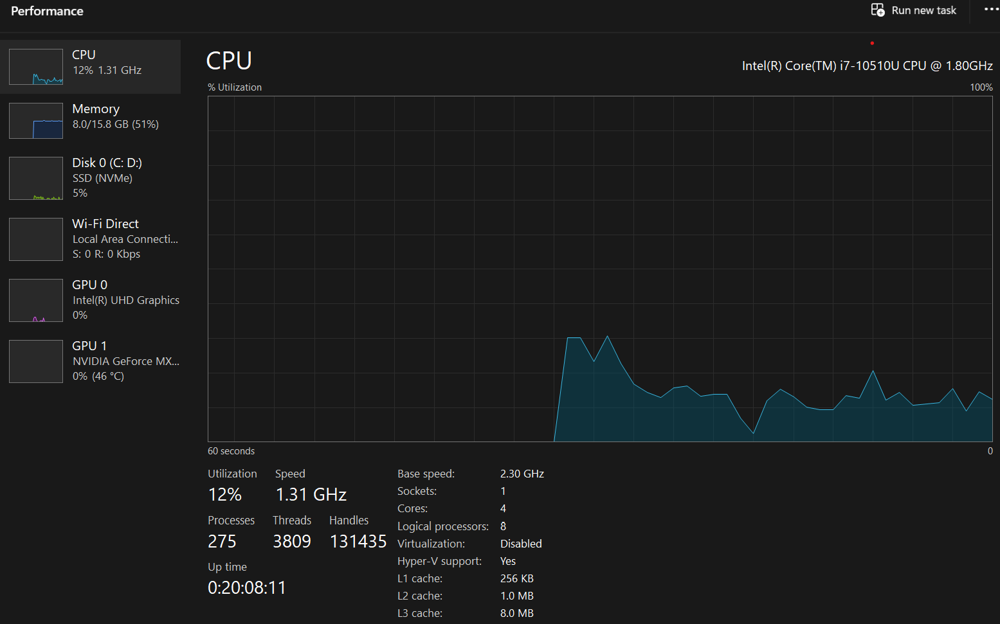
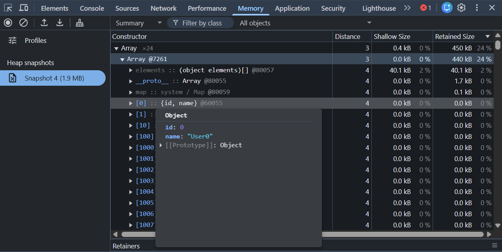
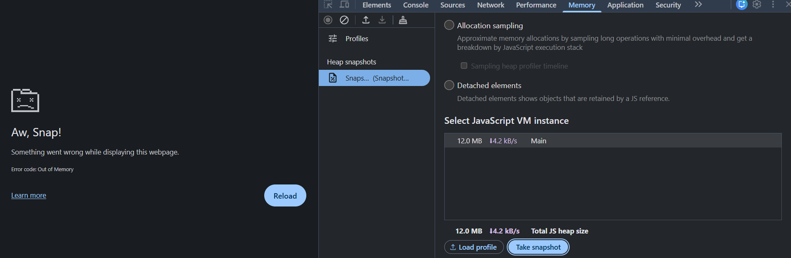
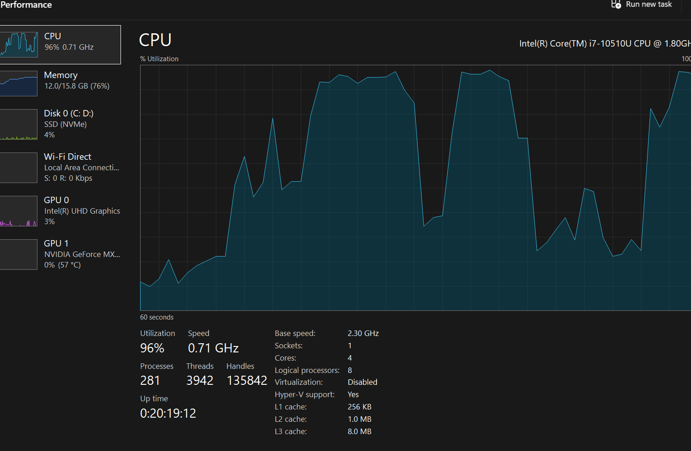

## Memory Fundamentals
1.where does data live while a program runs
2.what is ram
3.what is the stack
4.what is the heap
5.why does memory usage increases while application run
6.why does system becomes slow when many applicaions are open

## Create a mental movie
our programs willl run in ram what happens if ram is full,where will new data go?
for this situation if our ram is full but we need to run a new application so at that time our os swaps the old data in ram to storage and replaces the new application in that place it is known as paging files or swaping.then executes new data.

what if storage is also full...?
if storage is also full then there is no chance to replace so the os trys to crash our new application..

## Part-2 Experiment 1
Q:Where does the veriable exist while the page is running
the veriable will live inside the ram after the page starts running
the browser allocates or organize the this memory using two different structures 

1.call stack and the heap 
## call satck 
handles fast memory allocation execution context it stores primitive data like number,string,boolean,null,undefined,symbols,
executes current functions or global scope 
it stores references also like address of the complext objects 
## the heap
it is large and unstructured it stores objects ,arrays,functions and dates
dynamic data : data that grows increases in size while program runs

## memory clean up veriavles do not stay forever 
a veriable no longer reachable by a code will cleanup by the garbage collector.autometicaly free up ram space

## Experiment 2
while 1000 objects are created .in the memory section it showed that 41.2 kb is used 

## experiment 3
now create 10000 users and observe ...
## Before 
cpu usage is 9% memory 51% , disk 3%

## after

no big change in memory when 10k users created
at 100k no difference 
100000k when tried to create got error

cpu perfomence and memory

what i understood 
## RAM
it is a temporery space where the data can access very fastly so the os loads any application first into RAM and after that allocates cpu time and memory 

## stack 
it is place where after any function or program runs the veriable created is moved to stack if it is a primative type and can accessed fastly it is fast and also stores refernces of complext types addresses

## heap 
it is a place where the dynamic data means where it has a chance to grow increase the size that data will stored in heap and the address of it is stored in stack with the defined veriable name and accessed with that address

