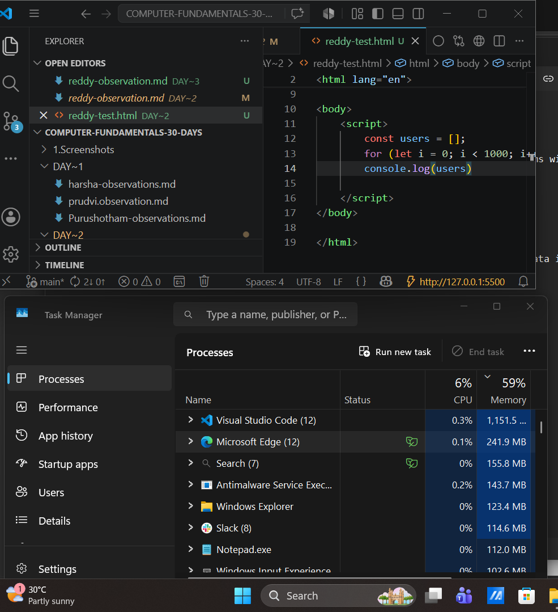

# Day 3 - Memory Fundamentals

## Goal

Understand:

* Where data lives while a program runs
* Why RAM exists
* Why memory usage increases
* Why computers become slow when memory is heavily used
* What Stack and Heap are
* Why Garbage Collection exists

The goal is not to memorize definitions.

The goal is to understand why these concepts must exist.

---

# Experiment 1

## Code

```javascript
let name = "Harsha";
console.log(name);
```

## Observation

The variable appeared in the browser console and the page continued running normally.

## Reasoning

The variable must exist somewhere while the page is running.

It cannot exist only in SSD because the CPU needs fast access to it.

## Conclusion

Variables are stored in RAM while the program is running.

---

# Experiment 2

## Code

```javascript
const users = [];

for(let i = 0; i < 1000; i++){
    users.push({
        id: i,
        name: "User " + i
    });
}

console.log(users);
```

## Observation

The browser worked normally.

The console displayed all created objects.

## Reasoning

The array and objects required memory space.

They must exist somewhere while the application is running.

## Conclusion

Objects and arrays consume RAM.

---

# Experiment 3

## Code

```javascript
const users = [];

for(let i = 0; i < 10000000; i++){
    users.push({
        id: i,
        name: "User " + i
    });
}

console.log(users);
```

## Observation

Memory usage increased in Task Manager.

Before execution chrome:



After execution chrome:


```text
200 - 260 MB
```

When program running:


```text
~400 MB
```

The memory did not immediately decrease after waiting several seconds.

## Reasoning

A million objects were created.

Each object requires memory.

More objects require more RAM.

## Conclusion

RAM usage increases as applications create more data.

---

# Mental Model

```text
SSD
↓
Program Stored
↓
Program Opened
↓
Loaded Into RAM
↓
Variables And Objects Created
↓
CPU Executes Instructions
↓
Output Appears
```

---

# Why RAM Exists

## Observation

CPU is extremely fast.

SSD is much slower.

If the CPU had to read every variable directly from SSD:

```text
CPU
↓
SSD
↓
CPU
↓
SSD
```

The system would become extremely slow.

## Conclusion

RAM exists as a fast workspace between SSD and CPU.

```text
SSD
↓
RAM
↓
CPU
```

---

# Understanding RAM

## What I Learned

RAM stores active program data while the computer is running.

RAM is:

* Fast
* Temporary
* Volatile

When power is removed:

```text
RAM Data
↓
Lost
```

RAM is used because CPU can access it much faster than SSD.

---

# Why RAM Is Organized

RAM is one large memory area.

It is not physically separated into different chips.

Think:

```text
House
├── Bedroom
├── Kitchen
└── Hall
```

Still one house.

Similarly:

```text
RAM
├── Stack Region
└── Heap Region
```

Still one RAM.

The organization exists because different types of data require different management strategies.

---

# Stack

## Why It Exists

Some data is:

* Small
* Predictable
* Short-lived

Example:

```javascript
let age = 20;
let score = 100;
```

The computer knows:

* Roughly how much memory is needed
* When the data will disappear

This makes memory management very easy.

## Mental Model

Think of a stack of plates.

```text
Add Plate
↓
Top

Remove Plate
↓
Top
```

Very fast and organized.

## What I Learned

Stack is optimized for:

* Small data
* Predictable data
* Short-lived data
* Fast allocation
* Fast removal

---

# Heap

## Why It Exists

Some data is:

* Dynamic
* Growing
* Unknown in size

Example:

```javascript
const users = [];
```

The computer does not know whether the array will contain:

```text
10 Users
100 Users
1000 Users
1,000,000 Users
```

The size can change continuously.

A flexible memory area is required.

## What I Learned

Heap is optimized for:

* Dynamic data
* Objects
* Arrays
* Growing data
* Unknown size

---

# Important Discovery

The real difference is NOT:

```text
Primitive vs Object
```

The deeper idea is:

```text
Predictable vs Dynamic
```

Stack handles predictable memory.

Heap handles dynamic memory.

---

# References

Example:

```javascript
const user = {
    name: "Reddy",
    age: 20
};
```

Simplified model:

```text
Stack
↓
Reference
↓
Heap
↓
Object
```

The variable does not necessarily contain the entire object.

Instead it contains information about where the object exists in memory.

---

# Garbage Collection

## Observation

After creating a large amount of data, memory did not immediately decrease.

## Question

If data is no longer needed, who removes it?

## Answer

Garbage Collector.

## Purpose

Garbage Collection is a memory cleanup mechanism.

It looks for objects that can no longer be reached by the running program.

Example:

```javascript
let user = {
    name: "Reddy"
};

user = null;
```

Now:

```text
Object Exists
↓
No Variable Can Reach It
↓
Garbage Collector Can Reclaim Memory
```

## Important

Memory may not decrease immediately.

Browsers often keep memory reserved because reusing memory is faster than constantly allocating and releasing it.

---

# Key Discoveries

## Discovery 1

Programs are stored on SSD.

Running programs use RAM.

## Discovery 2

Variables and objects consume RAM.

## Discovery 3

More data means more memory usage.

## Discovery 4

RAM exists because SSD is too slow for active program execution.

## Discovery 5

Stack and Heap are memory organization strategies inside RAM.

## Discovery 6

Stack is optimized for predictable memory.

## Discovery 7

Heap is optimized for dynamic memory.

## Discovery 8

Objects are commonly accessed through references.

## Discovery 9

Garbage Collection reclaims memory that can no longer be reached by the program.

---

# Final Mental Model

```text
Program Stored On SSD
↓
Program Opened
↓
Loaded Into RAM
↓
Stack Created
↓
Heap Created
↓
Variables And Objects Allocated
↓
CPU Executes Instructions
↓
Application Runs
↓
Unused Objects Become Unreachable
↓
Garbage Collector Reclaims Memory
```

---

# My Current Understanding

RAM is fast working memory used by running programs.

Stack and Heap are organizational strategies inside RAM.

Stack is used for small, predictable, short-lived data.

Heap is used for dynamic, growing, and less predictable data such as objects and arrays.

Objects are commonly accessed through references.

When data is no longer reachable, Garbage Collection can reclaim the memory for future use.
