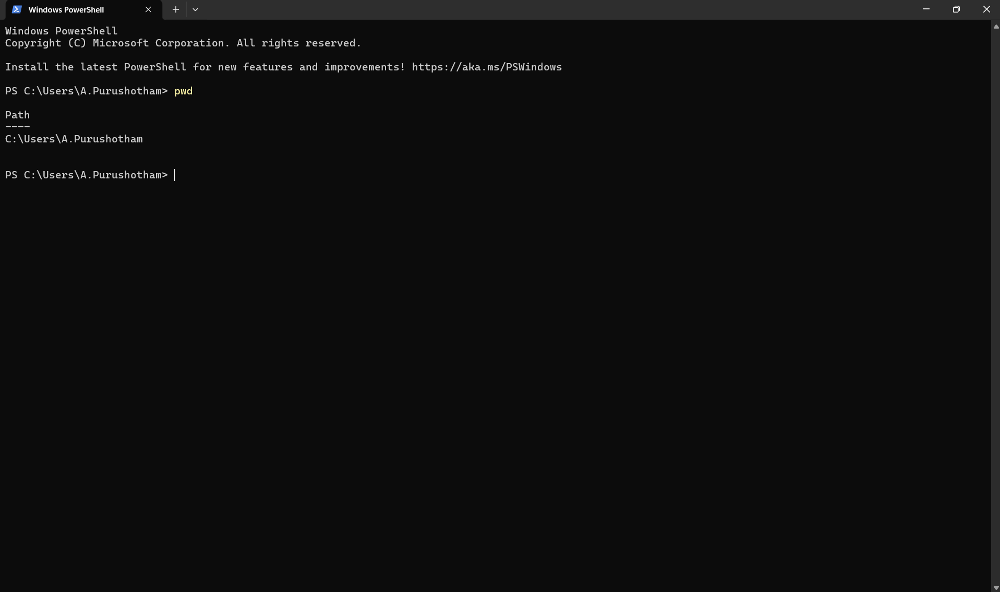
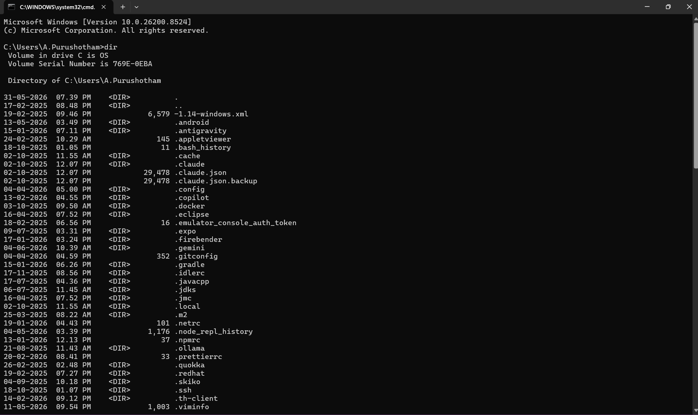
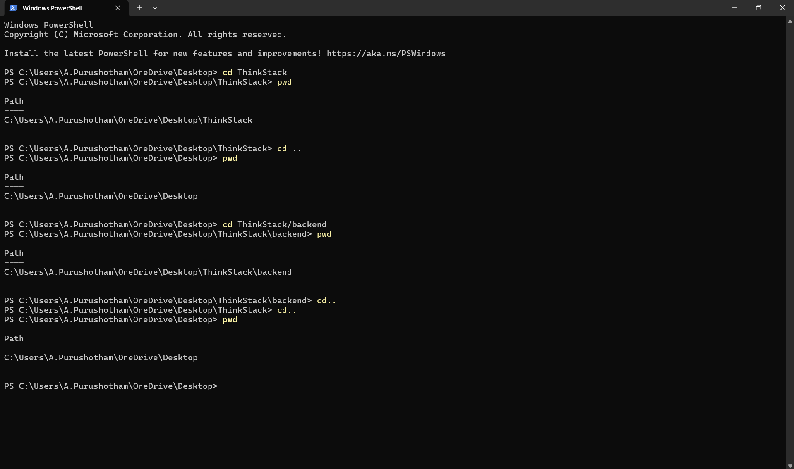
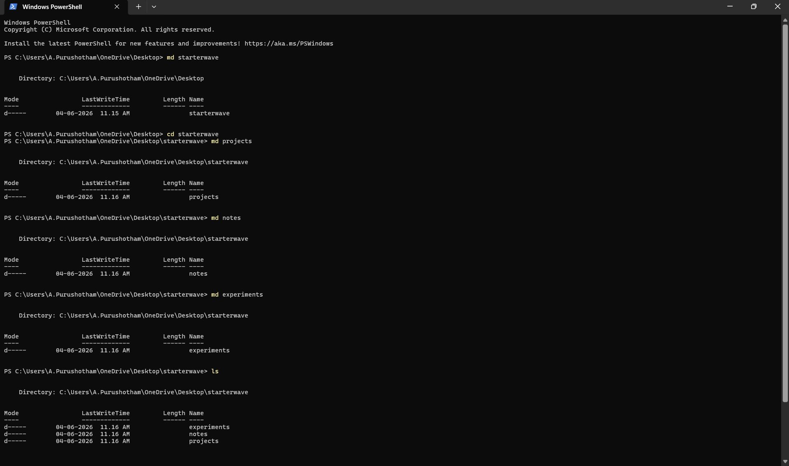
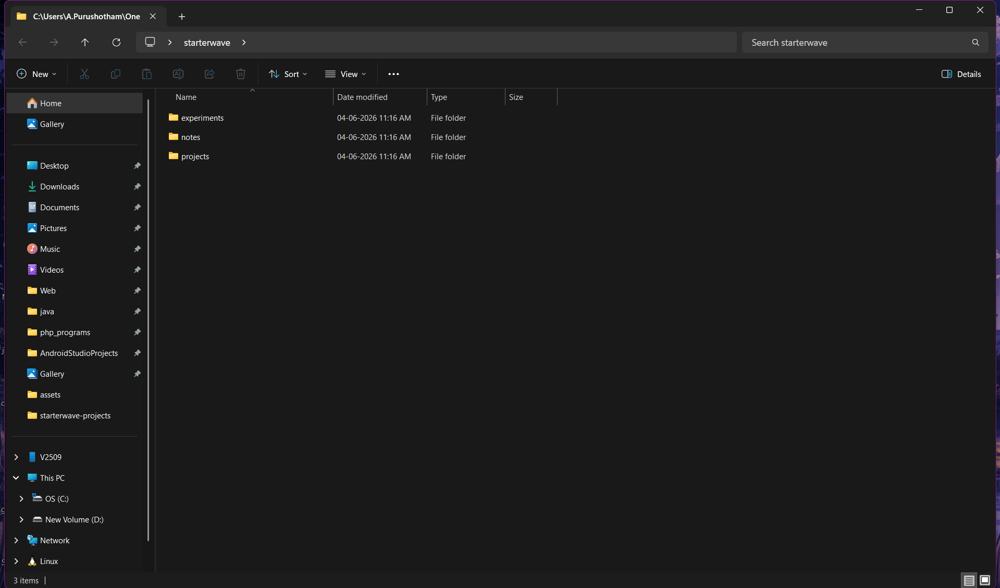
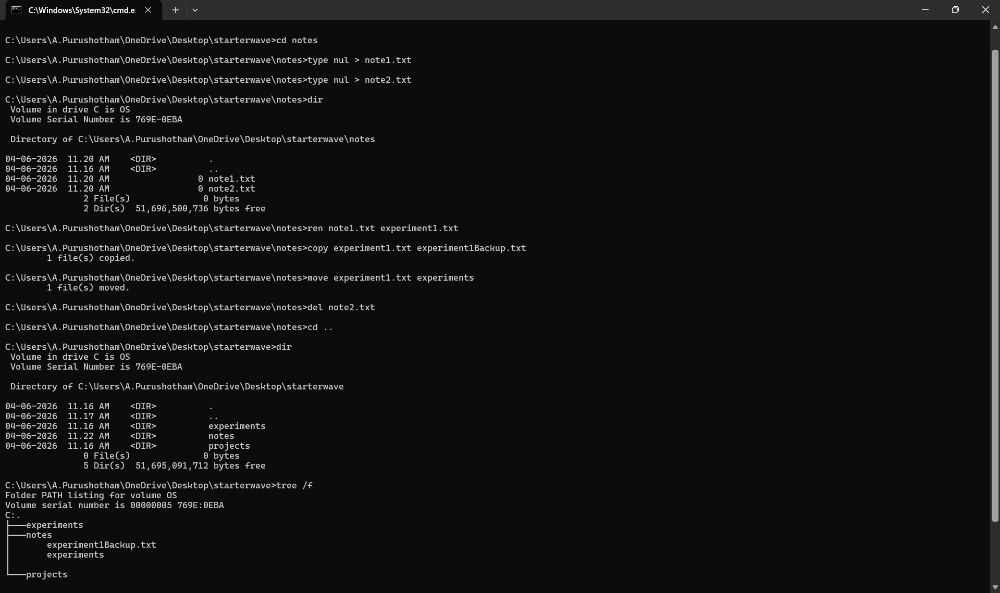
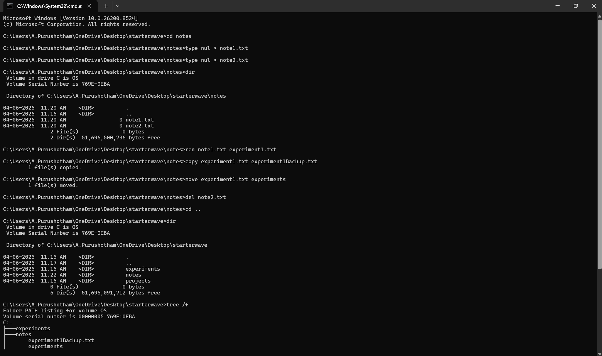
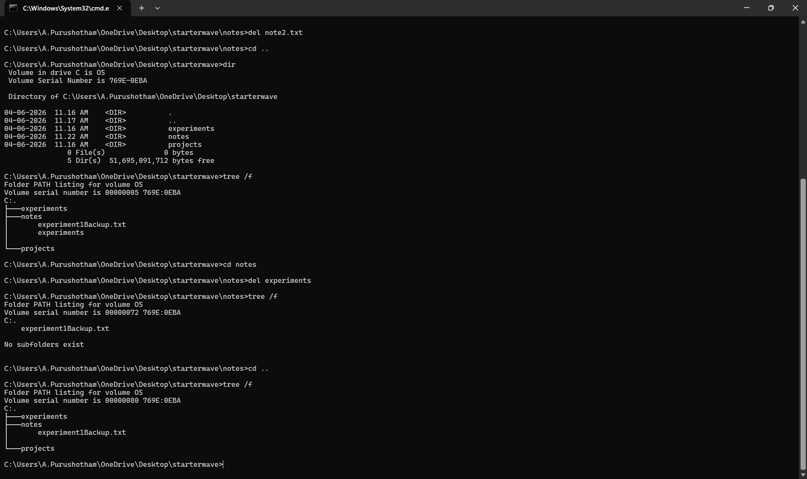
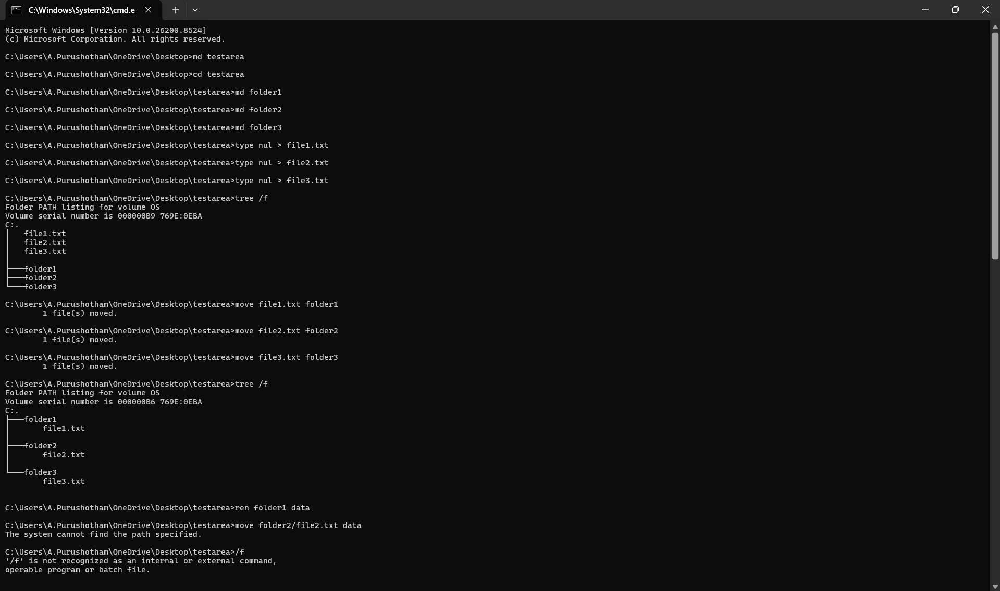
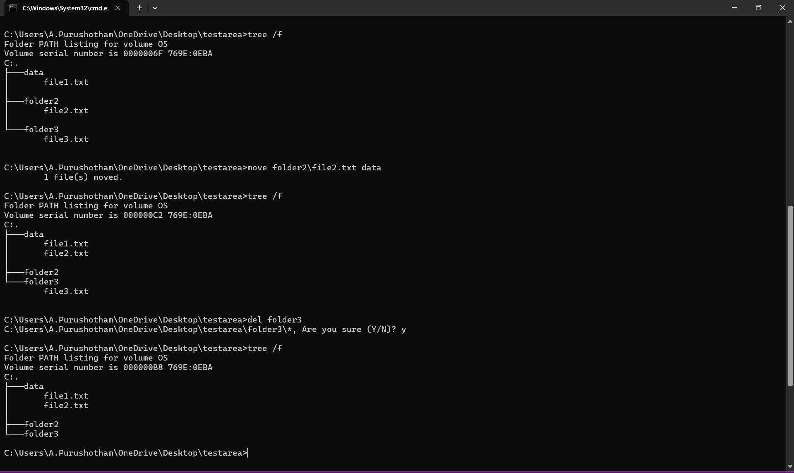

# Day 4: Discover How Your Computer Organizes Files

## PART 1: Understand Your Current Location

**Q: If I open a terminal right now, where am I?**
**A:** I am at location `C:/Users/A.Purushotham`. This is the current working directory (CWD) of the terminal.

**How to identify your current location?**
We can look at the prompt in the terminal which displays the path. The last folder name in the path is where you are currently located. Alternatively, you can use the `pwd` (Print Working Directory) command in PowerShell to get the full path.

**What information the terminal provides?**
The terminal provides the path to the current working directory.

**How the operating system represents locations?**
The operating system represents locations using **paths**.

---

## PART 2: Explore the FileSystem

**Q: How to view the contents of your current location?**
**A:** In the Command Prompt (cmd), we use the `dir` command to view the contents of the current location.

**What files exist here?**
There are 16 files in this directory.

**What directories exist here?**
There are 49 directories in this location.

**How does the terminal distinguish between them?**
Entries marked with `<DIR>` are directories, while names with file extensions (like `.txt`, `.exe`, etc.) are files.

**What information can you learn just by observing?**
By observing the output of the `dir` command, you can see a mix of files and directories, their creation dates and times, and the sizes of files in bytes.

---

## PART 3: Navigate Intentionally

**How does the operating system represent movement between locations?**
**A:** The operating system represents movement by updating the path of your Current Working Directory (CWD).

---

## PART 4: Create Your Own Structure

*In this part, I created a directory named `StarterWave` and inside it, I created `Projects`, `Notes`, and `Experiments` using the terminal.*

---

## PART 5: Investigate Files

**What changes when moving or renaming a file?**
The path to the file in its metadata and the directory entry change.

**What stays the same?**
The actual bytes of file data physically stored on the SSD remain in the same place.

**How does the filesystem react?**
The filesystem handles these operations by updating the metadata, such as the file's path, rather than moving the actual data bits unless necessary (like moving across different drives).

---

## PART 6: Understand Paths

* **Absolute Path:** Starts from the root (e.g., `C:\` or `D:\`).
* **Relative Path:** Starts from the current location.

**Why are paths necessary?**
Paths are necessary for the OS to uniquely identify the location of files and directories. Without them, the OS wouldn't know which specific file or folder is being referenced or how to access it.

**How would the OS locate a file without them?**
The OS cannot reliably locate a file without a path, as there could be multiple files with the same name in different locations across the filesystem.

---

## PART 7: Break Something and Recover

*Experimented with creating, moving, and deleting files in a test directory to understand how navigation and organization work through trial and recovery.*
