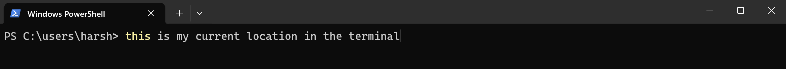
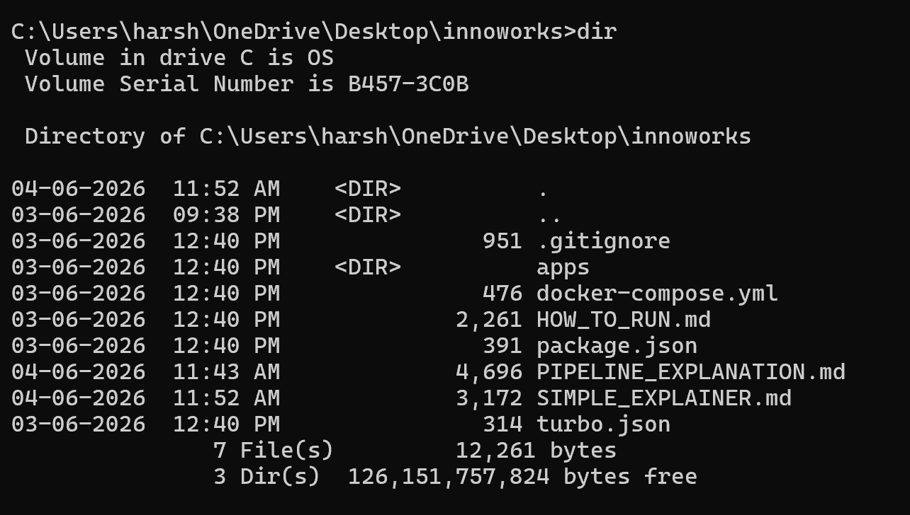
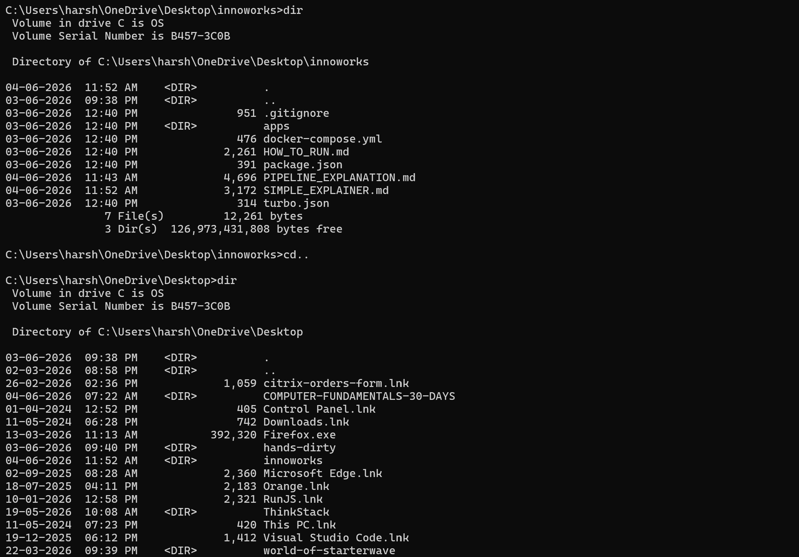
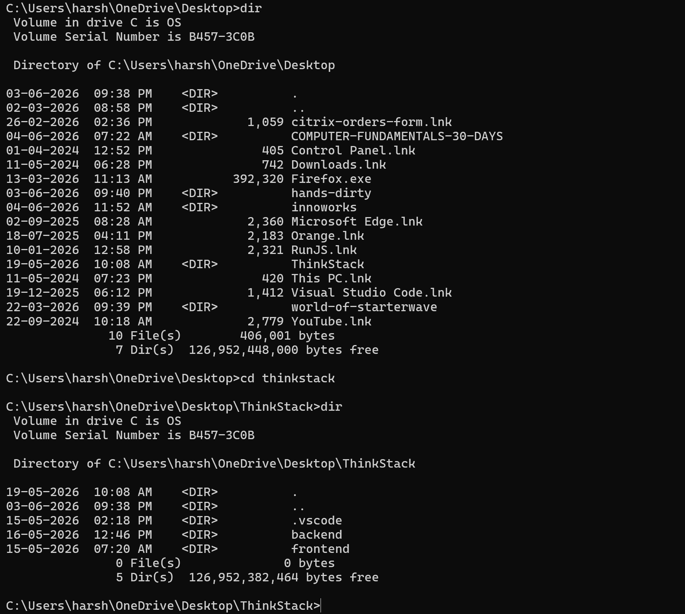
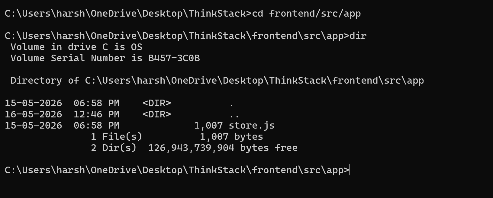
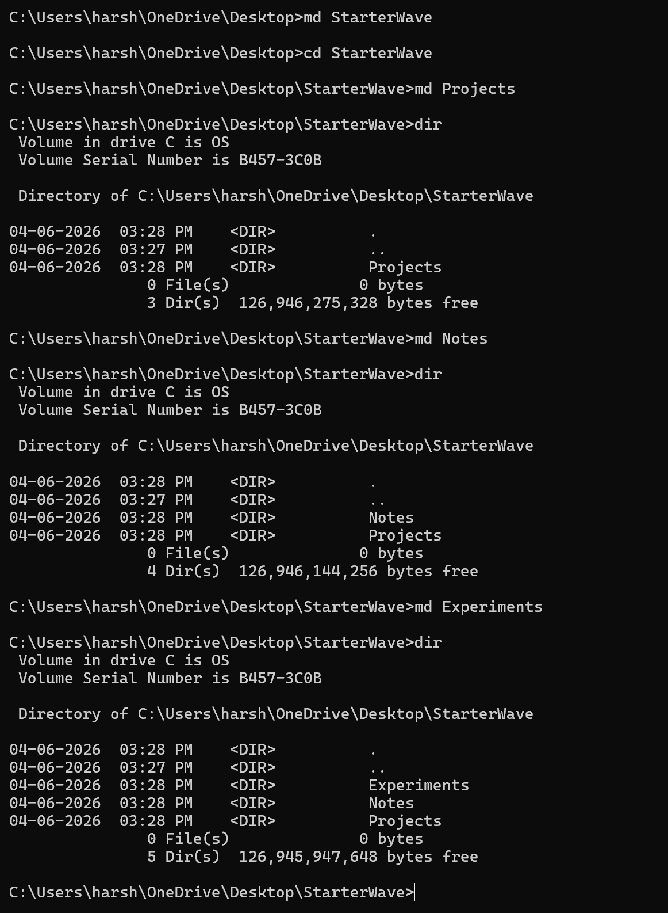
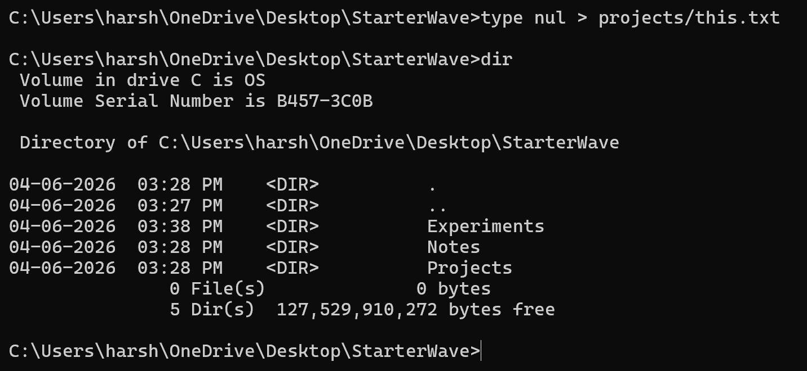
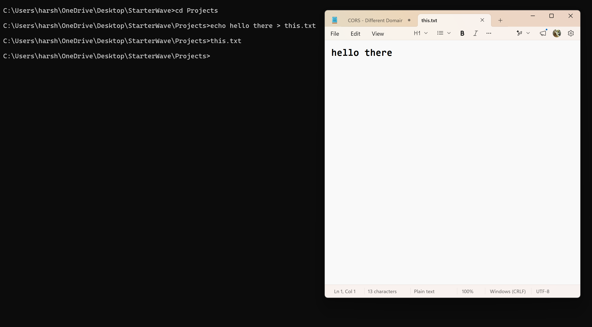
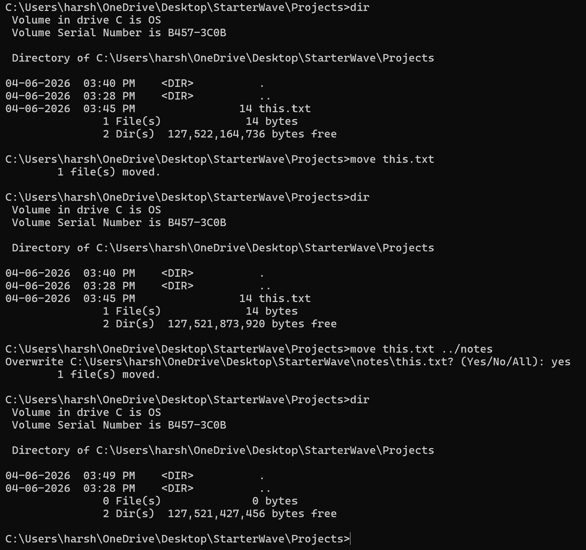
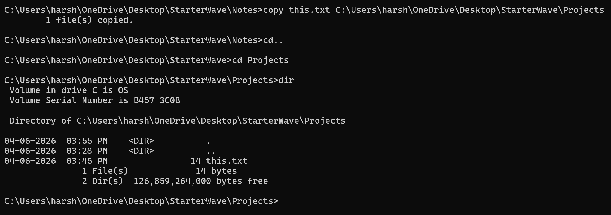

# **DAY 4 - Explore File System using Terminal**

## **Part 1 - Current Location**

### When I opened the terminal, the current location I'm present is C:/users/harsh.

### The operating system represents the locations using path.

 

## **Part 2 - Explore the File System**

### Running dir command in the terminal in a folder, the terminal displays the files & directories in it.

### We can observe directories mentioned as ``<DIR>`` for some rows in the output of the command.

### The rows which doesn't represent as ``<DIR>`` are files in the directory.

### And also in the terminal we can observe the number of files & directories.

 

## **Part 3 - Navigation**

### Initially, the terminal is at ``C:\Users\harsh\OneDrive\Desktop\innoworks>``. If we can observe the first 2 rows then we have . , .. as ``<DIR>``.

### If we use ``cd .`` command then the terminal present in the current directory.

### If we use ``cd ..`` command then the terminal moves to the parent directory.

### I executed this command from desktop ``cd thinkstack`` and the terminal went to thinkstack folder this how we can move from directories.

### Next from thinkstack, I executed another command ``cd frontend/src/app`` and the terminal moved to that path.

 

## **Part 4 - Create Structure**

### I created a directory with sub directories by the given structure:
StarterWave  
|__ Projects  
|__ Notes  
|__ Experiments

### I used ``md`` command to create directories.

### And I verified through ``dir`` command in the StarterWave directory.

 

## **Part 5 - Files Investigation**

### I created a file using Command called ``type nul > filename.txt``.

### And also I added some content to using ``echo content > filename.txt``.

### I moved this.txt from projects to notes directory.

### I copied the this.txt file from notes & pasted into projects directory.

### Finally, I deleted the this.txt from the projects directory.