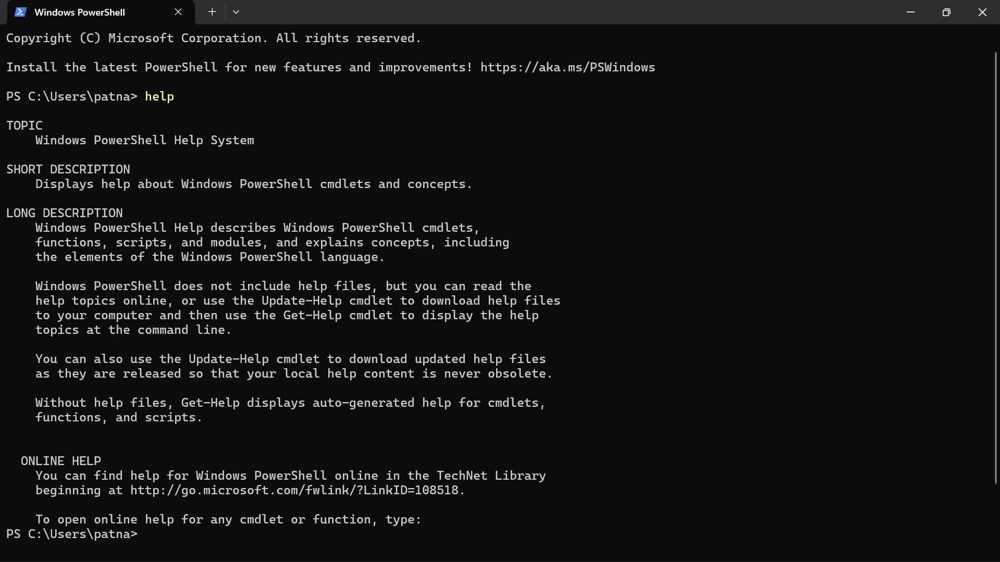
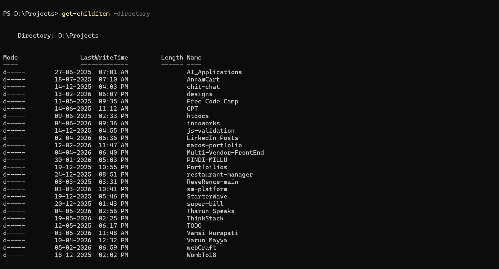
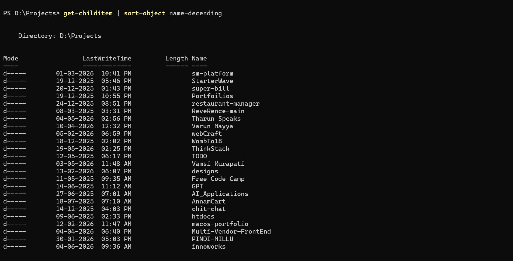

# Day ~ 4 [File Organizations in Computer]
# Observations - Patnam Prudvinath

## Part - 1 [Understanding current location in terminal]

### My Observation
So i opened the terminal, there i saw the prompt (which includes my current working directory indicator & cursor to take my input).

So that working directory indicator consists the path which is my **current location**.

And this **path** will start from root folder which is **'C Drive**' and the **OS** will follows the hirarchieal system to represent the locations.

---

## Part - 2 [Explore the Filesystem]

So to explore this FS, i started with the command **"get-childitem( and this 'ls' & 'dir' are alias for this get-childitem)**.  
And then i found we can **sort** and **filter** the contents we have in this folder.  
So for **filter** we can just **add space and -(hyphen) 'file' or 'directory' to the command(get-childitem)** 
-> i.e; **'get-childitem -file'**  

And for **sort** we will use **|(pipe) sort-object and 'keyword'** 
-> i.e; **get-childitem | sort-object name-decending(for order it is optional)**

And Then i created **file & folder** and i just known that mode(which we get at lists in terminal) represent the type of contents,  'd' means directory and  'a' means archive which refers to file.

### File Operations:
1. **Create** = **"new-item"** Prudvi **"-ItemType"** directory (or file for file).
2. **Rename** = **"ren"** "prudvi.txt" "Prudvi.txt"
3. **Write** = **"set-content"** "Prudvi.txt" "Text go here..."
4. **Read** = **"get-content"**, **"cat"**, **"type"** and then "prudvi.txt". (we have 3 cause due to different versions).
5. **Move** = we can use **"move"**, **"move-item"**, **"mv"** based on our versions and os. "mv "prudvi.txt" "D:/Backup/""
6. **Copy** = we can use **"copy"**, **"copy-item"**, **"cp"** based on our versions and os. "cp "prudvi.txt" "D:/Backup/""
7. **Delete** = we can use **"del"**, **"remove-item"**, **"rm"**, **"earse"** based on our versions and os. "rm "prudvi.txt"".

### Folder Operations:
1. Make Directory: 
-  The Quickest Way (Windows CMD Style) -> 
md "Projects"

-  The Standard Terminal Way (Linux Style) ->
mkdir "Projects"

-  The Official PowerShell Way ->
New-Item -Name "Projects" -ItemType "Directory"

2. Change Directory(For Drives too):
- The Universal Way (What everyone actually types) ->
cd "Projects"
- The Old Windows CMD Alternative ->
chdir "Projects"
- The Official PowerShell Scripting Way ->
Set-Location "Projects"

### How OS will update or change the PATH:
The OS tracks your location via a "Current Working Directory" variable, combining it with your cd path to search the system tree from that point (or from the root if it's an absolute path). 
If the OS successfully finds the matching folder path in the hierarchy, it updates your location; otherwise, it throws a "path not found" error.

##Why PATH is Necessary:
1. Address System for the OS. (It is the only one i think)
2. Preventing Name Clashes. (It is actually correct & imp)
3. Provides Security. (Blocking Access...)