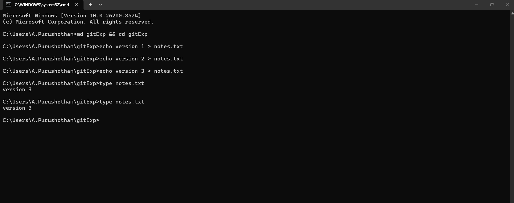
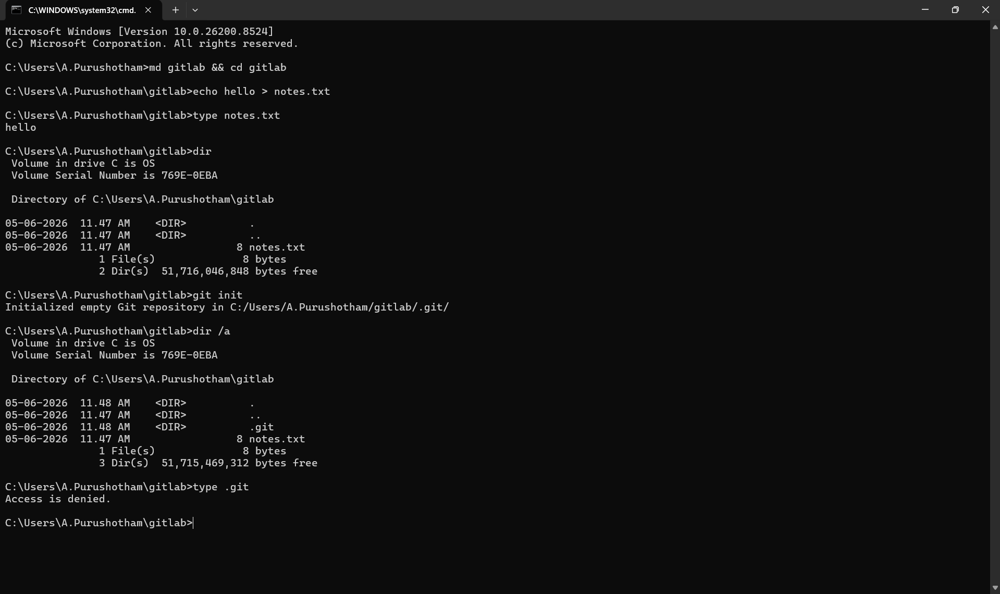
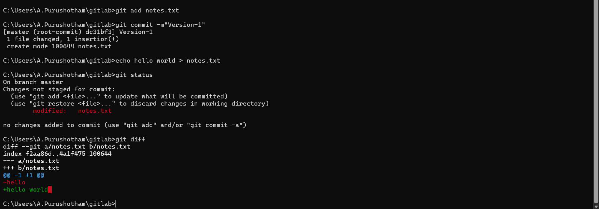
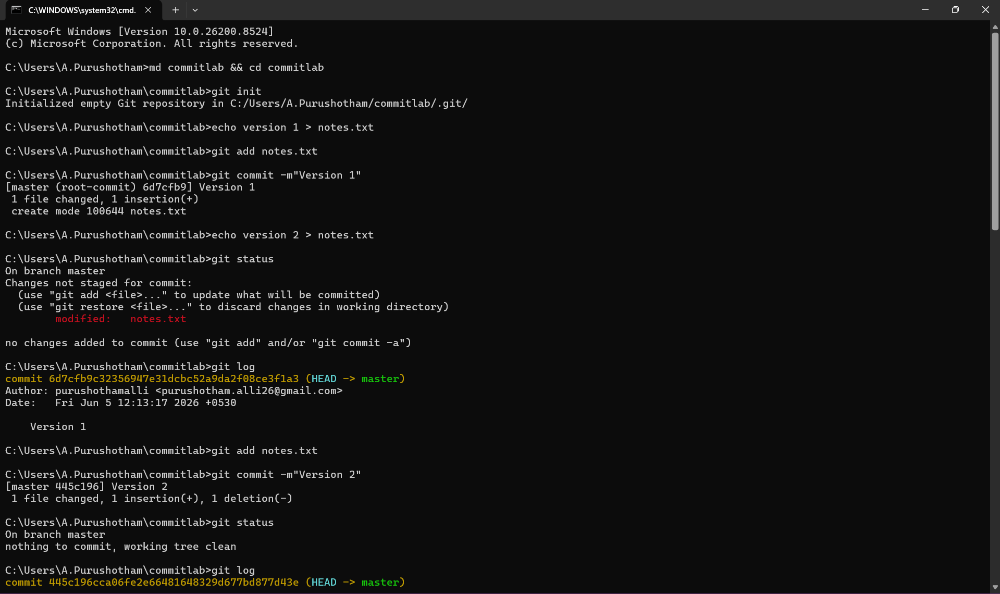
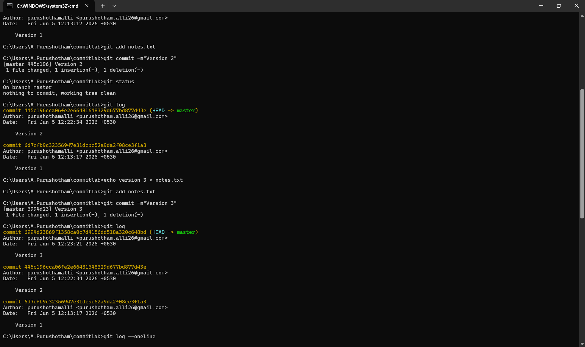
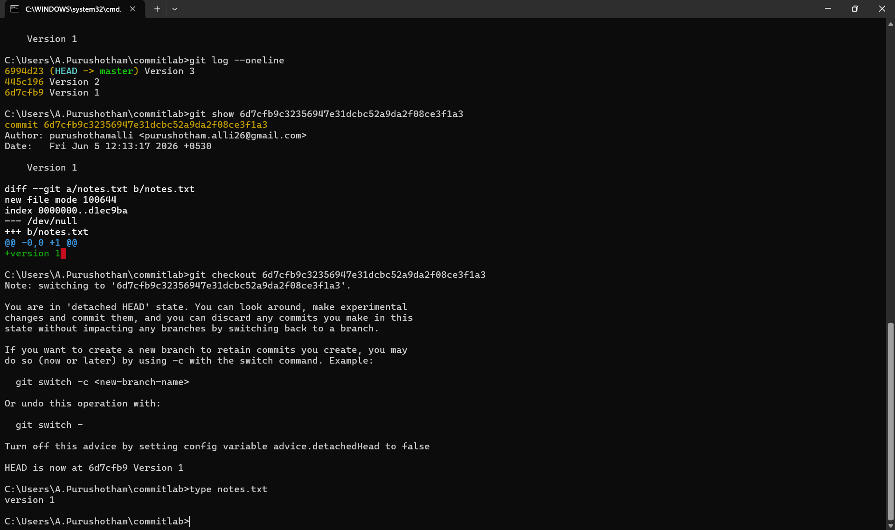
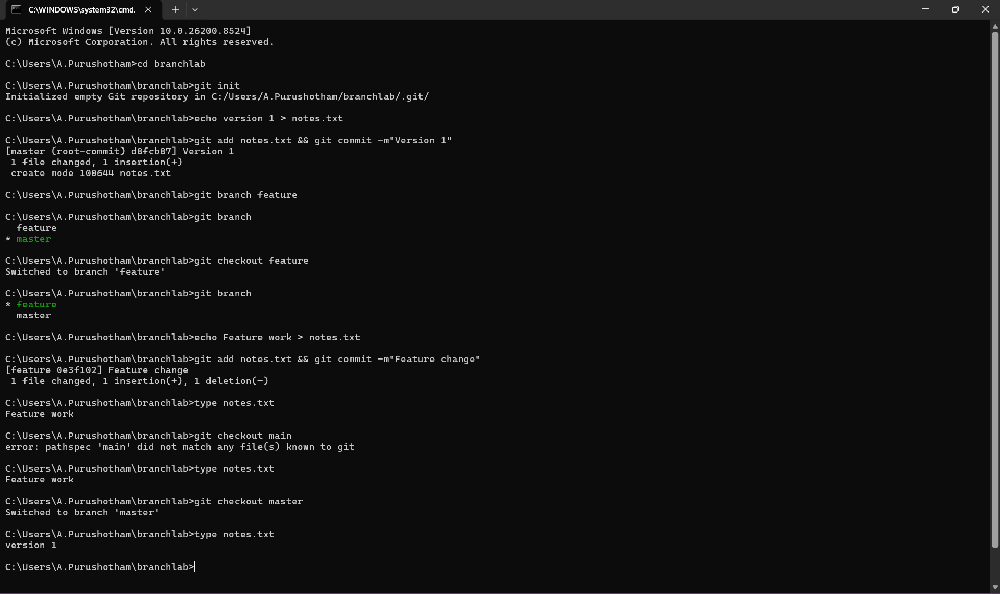
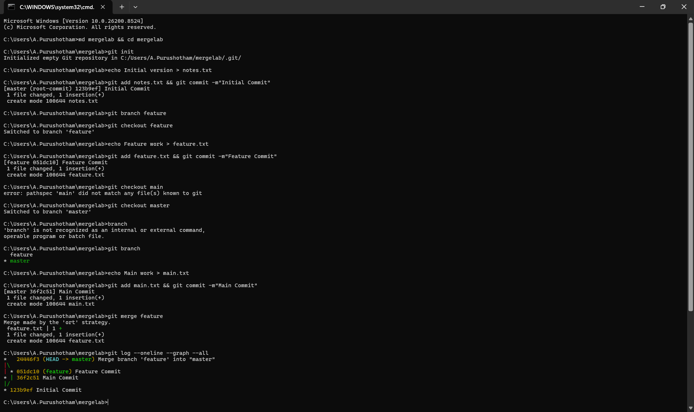
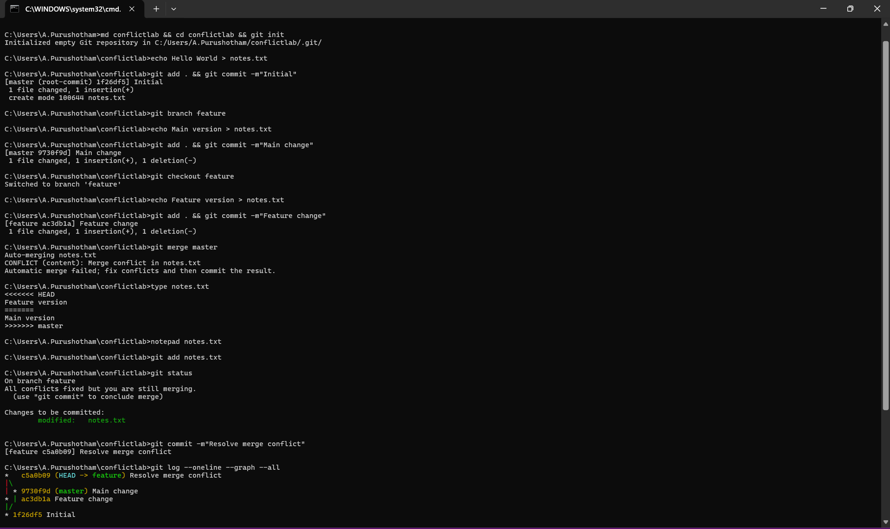

# Day 5 – Investigating How Software Remembers Its History

# Goal of Today's Mission

Today's mission was not to learn Git commands.

The goal was to understand:

> How does software remember its past?

Every Git concept exists because software teams face real engineering problems.

Instead of memorizing commands, I investigated the problems first and then discovered how Git solves them.

---

# The Core Problem

Imagine:

```text
Day 1 -> Project works
Day 2 -> Project works
Day 3 -> Project works
Day 4 -> Project breaks
```

Questions:

- What changed?
- When did it change?
- Who changed it?
- How do we recover?
- How do teams work together safely?

Git exists to solve these problems.

---

# Investigation 1 – Why Does History Matter?

## Experiment

Created a file and modified it multiple times.

```text
Version 1
Version 2
Version 3
```

Tried to recover Version 1.



## Observation

Only the latest version existed.

The old version was no longer accessible.

## Discovery

The filesystem stores the current state of a file.

It does not automatically maintain project history.

## Problem Identified

Without history:

- No rollback
- No recovery
- No visibility into past changes

---

# Investigation 2 – What Is A Repository?

## Experiment

Initialized a Git repository.

```bash
git init
```

Observed the creation of:

```text
.git
```

## Observation



Git created a separate storage area for project history.

## Discovery

A repository is more than a project folder.

A repository contains:

```text
Project Files
+
Project History
+
Git Metadata
```

## Problem Solved

Teams need a single source of truth for both code and history.

---

# Investigation 3 – What Is A Commit?

## Experiment

Created:

```text
Version 1
```

Committed it.

Modified file to:

```text
Version 2
```

without committing.

Checked history.

## Observation




History contained Version 1 only.

Version 2 was not part of history.

## Discovery

A commit is a saved project checkpoint.

Think:

```text
Game Save Point
```

instead of:

```text
Text Message
```

Commit messages are labels.

The actual commit is the saved project state.

## Problem Solved

Projects need identifiable milestones.

Without commits:

- No checkpoints
- No recovery points
- No meaningful timeline

---

# Investigation 4 – Can Time Move Backwards?

## Experiment

Created:

```text
Version 1
Version 2
Version 3
```

Committed each version.

Restored older versions using Git.

## Observation




Git recreated previous project states.

## Discovery

Git stores project snapshots.

Git can restore any saved state from history.

## Mental Model

```text
Git = Time Machine
```

## Problem Solved

Engineers need the ability to recover previous versions safely.

---

# Investigation 5 – Why Do Branches Exist?

## Experiment

Created a feature branch.

Modified files.

Returned to main branch.

Compared results.

## Observation



Changes from the feature branch did not affect the main branch.

## Discovery

Branches create independent timelines.

## Mental Model

```text
Main Timeline

      \
       Feature Timeline
```

## Problem Solved

Developers need isolation.

Without branches:

- Unfinished work affects everyone
- Experiments become risky
- Teams block each other

Branches allow safe independent development.

---

# Investigation 6 – Why Do Merges Exist?

## Experiment

Created:

```text
Main Changes
Feature Changes
```

Merged branches.

## Observation



Git combined both sets of changes.

A merge commit was created.

## Discovery

Branches solve isolation.

Merges solve integration.

## Mental Model

```text
Developer A
Developer B
Developer C

      ↓

Merge

      ↓

Final Product
```

## Problem Solved

Independent work eventually needs to become one product.

---

# Investigation 7 – Breaking Git (Merge Conflicts)

## Experiment

Modified the same line differently in two branches.

Attempted a merge.

## Observation



Git stopped the merge.

Conflict markers appeared:

```text
<<<<<<< HEAD
Feature Version
=======
Main Version
>>>>>>> master
```

## Discovery

Git can detect conflicting changes.

Git cannot understand human intent.

Only developers know which version is correct.

## Problem Solved

Git avoids making dangerous assumptions.

Merge conflicts force human review when ambiguity exists.

---

# Investigation 8 – What Problem Does Each Concept Solve?

| Concept        | Problem It Solves                           |
| -------------- | ------------------------------------------- |
| Repository     | Organizing a shared project and its history |
| Commit         | Creating checkpoints and recovery points    |
| Branch         | Allowing independent development            |
| Merge          | Combining independent work                  |
| Merge Conflict | Preventing incorrect automatic decisions    |

---

# Final Mental Model

```text
Repository
    ↓
Shared History

Commit
    ↓
Checkpoint / Snapshot

Branch
    ↓
Independent Timeline

Merge
    ↓
Timeline Integration

Conflict
    ↓
Human Decision Required
```

---

# Final Understanding

Before today, Git felt like:

```text
git add
git commit
git merge
```

a collection of commands.

After today's investigations, Git feels like a system designed to solve real engineering problems:

- History
- Recovery
- Collaboration
- Isolation
- Integration
- Conflict Resolution

Git is essentially a time-travel and collaboration system for software projects.
