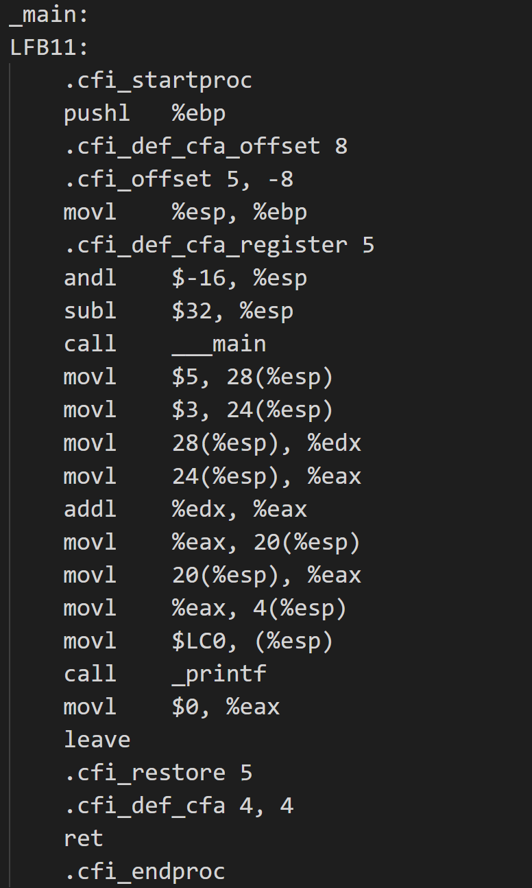

# **Why Does A Computer Need A CPU?**

## **What problem would exist if a computer had no CPU?**
### As of now, I know CPU executes instructions & performs some calculations. 
### So, if it doesn't exists then OS cannot be executed, nothing displays on the screen, files & apps cannot be opened, even no calculations gets performed.

### **What is an instruction?**
### They are the commands that CPU can understand & execute. Ex: ADD 3, 5; MOV R1, 3; LOAD X, etc.

---

## **How these instructions are executed?**
### CPU continously performs a cycle called FETCH, DECODE, EXECUTE.
1. **FETCH:** Find out the next instruction from the RAM.
2. **DECODE:** CPU understands the instruction.
3. **EXECUTE:** CPU performs or executes the instruction.

### I observed the instructions executing by the CPU of the below program in a practical way.
    int a = 5, b = 3;
    int c = a + b;
    printf("%d", c);

- Run the program using this command ``gcc -S filename.c``.

### These are assembly level language instructions of the above program.


---

## **How can you feel the Speed of the CPU?**

### And we can observe the speed of CPU, my Laptop's CPU speed is 2.5GHz. 

### 1Hz = 1 event per second, 2.5GHz = 2,500,000,000 events per sec.

### It means the CPU can perform nearly 2.5 Billion cycles in 1 Second. We don't even capable of counting them.

### We can feel that speed by counting operation programs.
    long long x = 0;
    while(1) {
        x++;
    }

### In 5 Sec CPU incremented the value in x from 0 to 59098. So, we can feel how speed it is.

---

## **What is the one thing that changed the computers being like a calculator in olden days to speedy machines?**

### Transistors made the computer so fast than before where they allowed to store an electric charge like 0 or 1. 

### Before Transistors, Vaccum Tubes were used. They are huge, expensive, consume lots of electricity and generates lots of heat.

## **How Transistors increased the speed of the computer?**

### As they are small in size they can be used at high scale and more calculations can be performed.

## **Flow of execution of program with transistors**

```
int a = 5;

int b = 3;

int c = a + b;
```
### The above code is written in C, a high level language code.

### When it is compiled it becomes:
1. MOV R1, 5
2. MOV R2, 3
3. ADD R3, R1, R2

### The assembly level instructions are converted into Binary instructions by the Assembler using Instruction Set Architecture.

### In ISA the engineers will predefine the Binary Instruction for every instructions like a dictionary.
- Ex: 0001 = MOV, 0010 = LOAD, 0011 = ADD, 0100 = SUB

### So, the above instructions are converted into binary:
1. MOV R1, 5 -> 0001000100000101
2. MOV R2, 3 -> 0001001000000011
3. ADD R3, R1, R2 -> 0011001100010010

### These all instructions are stored in RAM.

### Next CPU fetches each instruction from the RAM.

### The CPU decodes the instructions using transistors like if the first 4 bits are 0001 then they will consider it as a MOV operation. It is done through connecting the physical wirings to different parts of CPU.

### CPU stores 5 in R1 & 3 in R2.

### Now, the ALU takes the R1 & R2 registers and performs addition operation using half & full adders. And it stores the result into R3. 
---