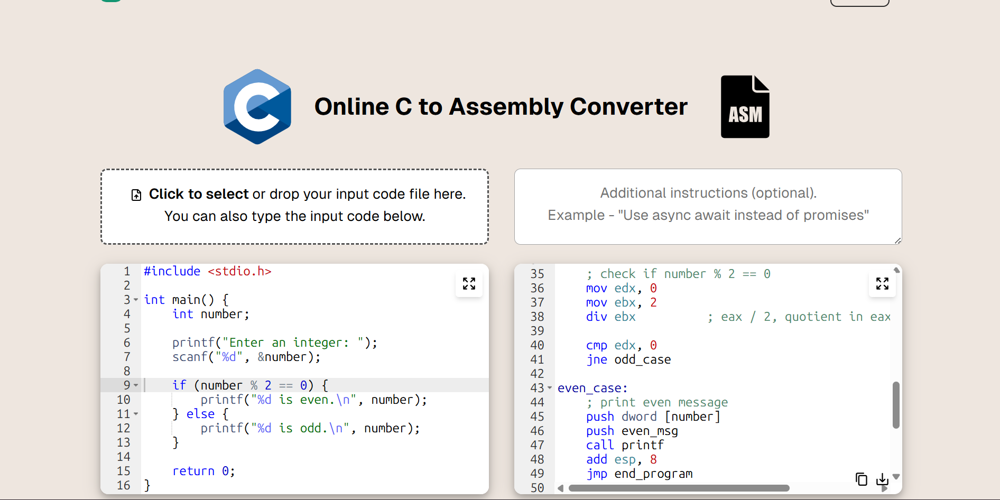

# Day ~ 5 [CPU Fundamentals]

# Observations - Patnam Prudvinath

## Part - 1 [What happens if a computer does not have a CPU?]

### My Assumption:

---

I initially thought the computer might still turn on because RAM, SSD, keyboard, monitor and all other hardware are still connected.

But after researching, I found that all those components can only store data or send signals. None of them can actually understand instructions or decide what to do next.

### My Research:

---

The CPU is the component that continuously reads instructions and executes them.

Without a CPU:

* RAM can store data, but nobody reads it.
* SSD can store programs, but nobody loads them.
* Keyboard can send signals, but nobody processes them.
* The Operating System never starts.

So technically the computer becomes a collection of hardware components that cannot perform any useful work.

A simple way I understood it:

> Programs exist. 
> Data exists. 
> Instructions exist. 
> But nothing executes them.

So a general-purpose computer cannot work without a CPU.

---

## Part - 2 [What does the CPU actually do?]

### My Assumption:

---

Before researching, I know the CPU was will execute instructions, but not how.

### My Research:

---

After reading about the Fetch-Decode-Execute cycle, I realized calculations are only one small part of the CPU's job.

The main responsibility of the CPU is:

* Fetch instructions from memory.
* Decode what those instructions mean.
* Execute those instructions.

This process keeps repeating billions of times every second.

### The Fetch Stage:

---

The CPU first checks the Program Counter (PC).

The PC contains the address of the next instruction.

1. PC copies the address into MAR (Memory Address Register).
2. MAR requests the instruction from memory.
3. The instruction arrives in MDR (Memory Data Register).
4. MDR copies the instruction into CIR (Current Instruction Register).
5. PC moves to the next instruction address.

### The Decode Stage:

---

The Control Unit reads the instruction stored inside CIR.

It separates:

* Opcode → What operation to perform.
* Operand → Which data is needed.

Then the CPU prepares the required resources.

### The Execute Stage:

---

Finally, the CPU performs the actual operation.

Examples:

* Addition
* Multiplication
* Comparing values
* Moving data
* Storing data

If calculations are needed, the ALU (Arithmetic Logic Unit) performs them.

After execution finishes, the CPU immediately starts fetching the next instruction.

---

## Interesting Observation [Why MDR and CIR Both Exist?]

While reading the Fetch-Decode-Execute cycle, I had a doubt.

If the instruction already exists in MDR, why copy it again into CIR?

After understanding it better, I found:

* MDR is a temporary memory-transfer register.
* CIR stores the instruction currently being executed.

During execution, the CPU may need MDR again to fetch additional data from memory.

If the instruction stayed only inside MDR, it would get overwritten.

So the CPU moves the instruction into CIR and keeps it safe while MDR gets reused for other memory operations.

This separation allows the CPU to execute instructions while still communicating with memory at the same time.

## Main Components I Found:
Control Unit (CU) → Directs the operations inside the CPU. 
ALU (Arithmetic Logic Unit) → Performs calculations and comparisons. 
Registers → Tiny ultra-fast storage locations inside the CPU. 
RAM → Not part of the CPU, but constantly communicates with it.

## [How Instructions Are Stored]

The CPU understands these binary instructions using something called an Opcode.

Every instruction contains:

Opcode → What operation to perform.
Operand → The data or memory location involved in the operation.

Example:

LOAD_A 14

Here:

LOAD_A = Opcode
14 = Operand

The CPU reads the opcode first and then performs the corresponding action.

## [What Controls the Speed of the CPU?]

I also learned about the CPU Clock.

The CPU Clock generates regular electrical pulses.

Each pulse tells the CPU to move forward in its work.

Example:

Fetch
↓
Decode
↓
Execute
↓
Next Instruction

The clock helps synchronize these operations.

CPU speed is measured in Hertz (Hz).

Examples:

1 Hz = 1 cycle per second
1000 Hz = 1000 cycles per second
1 MHz = 1 million cycles per second
1 GHz = 1 billion cycles per second

Modern processors operate at several GHz, meaning they can perform billions of clock cycles every second.

## Part - 3 [Code to Binary what CPU see - Practically wathcing what CPU actually sees from my code]

### What Triggered This Question?

After learning about the CPU, registers, ALU, and the  Fetch → Decode → Execute cycle, a new question came to my mind.

We write programs like:

> int a = 5; 
let a = 5; 
a = 5 

But the CPU only understands binary instructions.

So my doubt was:

>If developers write code in human-readable languages, how does that code eventually become something the CPU can execute?

My Initial Thought

>At first, I assumed every programming language directly becomes Assembly and then Binary.

After researching, I found that this is mostly true for learning purposes, but different languages actually take different routes before reaching machine code.

The common thing is:

Source Code 
    ↓ 
Some Translator 
    ↓ 
Machine Code 
    ↓ 
CPU

No matter which language is used, the CPU eventually receives machine instructions.

Understanding the Complete Flow with C

Since Assembly is easier to understand than raw binary, I decided to follow the journey using C.

### Example 
int a = 5; 

Stage 1 - Source Code 
---

This is the code written by the developer.

int a = 5;

At this point it is just plain text inside a file.

The CPU has no idea what this means.

Stage 2 - Compiler
---

The compiler reads the C code and translates it into Assembly Language.

Example:

mov eax, 5

Which roughly means:

Move the value 5 into register EAX

This was the first time I saw something that looked closer to what the CPU actually executes.

Stage 3 - Assembler
---

The assembler converts Assembly into Machine Code.

Example:

mov eax, 5

becomes:

10111000 00000101

Now the instruction is in binary form.

At this stage, the CPU can finally understand it.

Stage 4 - Loading Into Memory
---

The Operating System loads the machine code into RAM.

SSD 
 ↓ 
RAM 
 ↓ 
Ready To Execute

The program is no longer just a file on disk.

It is now a running process in memory.

Stage 5 - CPU Execution
---

The CPU begins executing instructions.

Fetch 
 ↓ 
Decode 
 ↓ 
Execute

The machine instruction is decoded and executed.

Result:

EAX = 5

The CPU has successfully performed the operation.

Complete C Journey
--
C Source Code  
      ↓  
Compiler  
      ↓  
Assembly  
      ↓  
Assembler  
      ↓  
Machine Code  
      ↓  
RAM  
      ↓  
CPU  
      ↓  
Fetch → Decode → Execute   

How Other Languages Reach the CPU
---
Java
--
Java Source Code  
      ↓  
javac  
      ↓  
Bytecode (.class)  
      ↓  
JVM  
      ↓  
Machine Code  
      ↓  
CPU  

Python 
--

Python Source Code  
      ↓  
Python Bytecode   
      ↓  
Python Interpreter  
      ↓  
Machine Code  
      ↓  
CPU  

JavaScript (Chrome)
--
JavaScript Source Code  
      ↓  
V8 Engine  
      ↓  
Bytecode  
      ↓  
JIT Compiler  
      ↓  
Machine Code  
      ↓  
CPU

