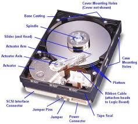
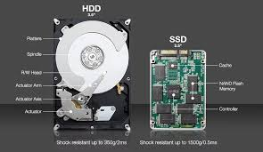
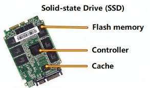

### today's concept: HDD (Hard Disk Drive) & SSD (Solid State Drive).
------------------------------
## 1. Why Were They Invented? (The Purpose)
CPUs, registers, and RAM are excellent for processing data, but they have one massive flaw: they are volatile. The second you turn off the computer, all data stored in them vanishes instantly.
HDDs and SSDs were invented to provide non-volatile, persistent storage. Their sole purpose is to hold your operating system, files, games, and photos safely forever, even when the computer has zero power.
------------------------------
## 2. What Problem Existed Before It?
Before modern persistent storage solutions like HDDs and SSDs matured, early computers faced critical limitations:

* The Memory Wipe: Every time a computer restarted, humans had to manually re-enter the entire program using paper punch cards or magnetic tapes.
* Tiny Capacities: Early storage methods could only hold a few kilobytes of data, making it impossible to store large media files, complex operating systems, or databases.
* Massive Physical Size: To store just a few megabytes, you needed giant, room-sized machines with spinning magnetic drums.

------------------------------
## 3. What Would Happen If This Concept Did Not Exist?
Without HDDs and SSDs, computers would be entirely impractical for everyday life:

* You would have to install your operating system (like Windows or macOS) from scratch via a physical cartridge or disc every single time you turned on your machine.
* You could never save a game file, download an app, or keep a photo on your device permanently.
* Smartphones wouldn't exist, because they wouldn't have internal flash storage to hold your apps and photos while powered off.

------------------------------
## 4. Important Components & Why They Exist 
## Hard Disk Drive (HDD) — The Mechanical Approach

An HDD works like a high-tech record player:

* Platters (Magnetic Disks): Shiny, circular glass or aluminum disks coated with a magnetic material. They exist to physically hold the magnetic bits (1s and 0s).
* Spindle Motor: Spins the platters at incredible speeds (usually 5,400 or 7,200 RPM). It exists because the data must pass under the read/write head quickly.
* Read/Write Head: A microscopic magnet floating on a cushion of air just nanometers above the spinning platter. It exists to alter the magnetic field (write data) or read the existing magnetic fields (read data).
* Actuator Arm: A mechanical arm that moves the read/write head back and forth across the platter. It exists so the head can reach data stored on the inner or outer rings of the disk.

## how it writes
* the computer sends a pattren of electrical currents to write head
* this current passes through a tiny coil inside the head and creates magantic filed
* this field changes the magnetic alignment of microscoopic spot on the platter below it
* in platter below spot pointing same way align represents 1,pointing opposite way represents 0
 

## Solid State Drive (SSD) — The Microchip Approach
An SSD has zero moving parts and looks like a circuit board:

* NAND Flash Memory Chips: Clusters of billions of microscopic electronic switches (transistors) called "floating gate cells." They exist to trap electrons securely in place to represent data, even without power.
* The Controller: The "brain" of the SSD. It handles where data is physically placed on the chips, manages speed, and ensures the memory chips wear out evenly.

## how it writes 
* ssd works by trapping or releasing electrons inside microscopic electronic cells using no moving parts.
* each cell acts like electronic cage 
* the ssd controller applies precise high voltage to cell
* this voltage froces electrons to push into the cage
* when voltage stops it seals the electrons inside cage trapping them,its how even power turned off data remines 

------------------------------
## 5. Internal Workings Step-by-Step## How an HDD Reads a File:

   1. The Request: You double-click a video file. The CPU asks the HDD controller for it.
   2. The Search: Th
   e actuator arm physically swings the read/write head to the correct track on the platter.
   3. The Spin: The spindle motor rotates the platter until the exact magnetic sector containing your video passes directly beneath the head.
   4. The Translation: The head detects the tiny magnetic polarities (North/South = 1/0) and translates them into an electrical signal sent back to your RAM and CPU.

## How an SSD Reads a File:

   1. The Request: You double-click the same video file. The CPU asks the SSD controller for it.
   2. The Electrical Grid: The controller instantly sends an electrical voltage command to the specific coordinates (rows and columns) of the NAND flash chips.
   3. The Electron Check: The chip checks whether electrons are trapped inside the tiny gate cells. (Trapped electrons = 0, empty cell = 1).
   4. The Delivery: Because this happens entirely at the speed of electricity with zero physical movement, the data is instantly read and sent to the CPU in microseconds.

------------------------------
## 6. Show how this concept interacts with other computer science concepts.
Think of your computer as an office setup. The CPU is the worker at the desk, RAM is the top of the desk (where active files sit), and the SSD/HDD is the giant filing cabinet in the corner.
Persistent storage interacts directly with key computer science concepts:

* Virtual Memory (Paging/Swapping): When you open too many browser tabs and run out of fast RAM, the Operating System steals a chunk of your SSD/HDD to pretend it is extra RAM. The OS moves inactive tabs to the storage drive and brings them back when clicked.
* The Boot Process (OS Loading): When a computer turns on, the CPU has amnesia. It runs a tiny piece of permanent code (BIOS/UEFI) that tells it to go look at a specific sector on your SSD/HDD. The CPU then copies the Operating System files from the storage drive into RAM to bring the computer to life.
* Database Management Systems (DBMS): Databases must balance speed and safety. They hold active transactions in fast RAM, but they must continuously flush that data onto the HDD/SSD (Commit log) to ensure your bank balance or app settings aren't lost if the power cuts out.

------------------------------
## 7. Explain common misconceptions beginners have.

* Misconception 1: "Having a bigger SSD makes your games run at higher frame rates (FPS)."
* The Reality: Storage only affects loading times. Once a game or application is loaded, the files sit in RAM, and performance is determined strictly by your CPU and Graphics Card (GPU).
* Misconception 2: "SSDs last forever because they don't have moving parts."
* The Reality: SSDs actually have a finite lifespan measured in TBW (Terabytes Written). Writing data requires forcing electrons through an insulating barrier in the NAND flash chips. Over time, this physical barrier degrades, meaning an SSD cell can eventually wear out and become unwriteable.
* Misconception 3: "Deleting a file completely removes it from the drive immediately."
* The Reality: When you hit delete, the OS doesn't erase the data blocks to save time. It simply deletes the file's entry in its "index table" and marks that space as "available to be overwritten." The original data is still physically there until new data saves over it, which is why data recovery software works.

------------------------------
## 8. Give 5 challenge questions for group discussion.
These questions don't have a single "correct" textbook answer, making them perfect for testing deep understanding with a peer:

   1. If SSDs are entirely electronic and incredibly fast, why don't we just replace RAM completely with SSD technology to save money and keep data forever?
   ans:latency gap ram operates at speed of 10 to 20 ns,and ram at the speed of 10000 to 50000 ns speed 
   in ram can written infinatly without derading ,ssd cells will be degrade every time u written to ,ssd as volitale ram burns out flash cells with in weeks or months
   2. If an HDD platter spins at 7200 RPM and the head floats nanometers away, what physically happens to the drive when you accidentally drop a laptop while it is running?
   ans:head crashes the microscopic cushion of air which floationg above the platter collaps due to sudden physical shock
   * head collieds with magnatic plater spinning at 7200 rpm speed
   * it scraps off delicate magantic coating  and creates parament damage
   3. Why does a brand-new SSD feel incredibly fast when it's empty, but significantly slows down when you fill it past 85% capacity?
   ans:ssds cannot directly overwritten data they must erase a whole block of data of cells before writing new data
   * when the space is less th ssd controller sends garbage collector to erase the data blocks to fill it up with new data
   * instead of writting into new clean data cells ssds make dirves force to shuffle data around background
   4. If a file is stored across multiple scattered locations on a drive (fragmentation), why does this severely hurt HDD performance but barely impact an SSD?
   ANS: hdd relies on pysical arm if file is fragmented the arm it must physically move seek time and wait time for disk to spin rotationa latuncy for every fragment it takes milli secs for peice
   * but in ssd it is puerly electronicslly via an index map accesing  cell a is equals as accesing cell z so makes file scattering irrelevent to performance
   5. If data recovery relies on finding "un-overwritten" blocks, how would you design a software tool that guarantees a file is 100% unrecoverable?
   ans: to guarantee data is completely gone a software tool must circutes the os index deleteand over written physical medium 

------------------------------
## 9. Give a complete flow diagram in text form.
Here is the exact pathway data travels when you open an application (like a video game or web browser) saved on your drive:

[ USER INPUT ] -> Double-clicks Application Icon
       |
       v
[ OPERATING SYSTEM ] -> Looks up file location on the Storage File System
       |
       v
[ HARDWARE CONTROLLER ] -> Issues read command to HDD/SSD hardware
       |
       +-----------------------> IF HDD: Actuator arm seeks track -> Platter spins to sector
       |                         
       +-----------------------> IF SSD: Controller sends voltage -> Checks cell electrons
       |
       v
[ SYSTEM BUS ] -> Streams raw data blocks across the motherboard wires
       |
       v
[ SYSTEM RAM ] -> Receives and holds the running application files in memory
       |
       v
[ CPU CACHE / REGISTERS ] -> Pulls precise chunks of code for execution
       |
       v
[ CPU CORE ] -> Processes code -> Application appears on your screen!

------------------------------
## 10. Explain how this concept appears in real software systems.
As a software engineer, you rarely interact with the physical disk directly. Instead, you write code that leverages abstractions built into the operating system. Here is how storage characteristics dictate real-world software design:

* Caching Databases (Redis vs. MySQL): Because writing to an SSD/HDD introduces latency, large systems use an in-memory database like Redis to keep frequent data in ultra-fast RAM. They then asynchronously batch-write that data down to a persistent disk database like MySQL or PostgreSQL behind the scenes.
* Log-Structured Merge-trees (LSM Trees): Modern databases (like Cassandra or RocksDB) are optimized specifically for how SSDs work. Instead of constantly jumping around the disk to modify existing data blocks, they append all new data sequentially to the end of a continuous log file. This maximizes SSD write speeds and prevents unnecessary cell degradation.
* File Serialization: When an app closes, its state in RAM (live objects, variables) must be transformed into a flat stream of bytes (like a JSON, XML, or binary file) so it can be written to the HDD/SSD. This process is called Serialization, and it is the bridge between temporary memory and permanent storage.

------------------------------
## 11. Explain what an experienced engineer thinks about this concept that beginners usually miss.
When a beginner thinks about storage, they usually just look at the capacity (e.g., "I need a 1TB drive"). A senior engineer sees a complex map of trade-offs, architecture limits, and hidden costs:

* Random vs. Sequential I/O: A beginner assumes an SSD reads everything instantly. A senior engineer knows that reading one single 4GB file (sequential) is blindingly fast, but reading 4,000 separate 1MB files (random) causes an SSD’s performance to plummet due to controller overhead. They design software to read data sequentially whenever possible.
* The "Write Amplification" Problem: SSDs can read data at the page level (tiny blocks), but they can only erase data at the block level (large clusters of pages). If a software app constantly modifies tiny 4KB pieces of data, the SSD is forced to read an entire 512KB block, modify the 4KB part in memory, erase the whole physical block, and rewrite it. This burns through the SSD's lifespan much faster than expected.
* Silent Data Corruption (Bit Rot): Over years of sitting on a shelf without power, magnetic fields on an HDD can weaken, or electrons trapped in an SSD can slowly leak out. A senior engineer never trusts a single drive; they design redundant systems (RAID arrays or cloud backups) with automated checksums to detect and heal corrupted files before they break the application.

------------------------------
## 12. Summarize the concept in 5-10 Lines.
Persistent storage (HDDs and SSDs) solves the volatility problem of computer memory by keeping data alive when the power cuts out. While legacy HDDs rely on mechanical spinning magnetic platters and moving arms to find data, modern SSDs use solid-state microchips that trap electrons instantly using electricity. Because storage drives operate thousands of times slower than the CPU and RAM, software engineers must carefully optimize how code reads and writes files. Understanding these physical limits is what allows engineers to build incredibly fast, reliable, and fault-tolerant software systems that handle massive amounts of user data without losing a single bit.
Now that you have completed this entire engineering breakdown, would you like to apply this exact 12-question structure to another computer science concept (like RAM, Networks, or Operating Systems)?